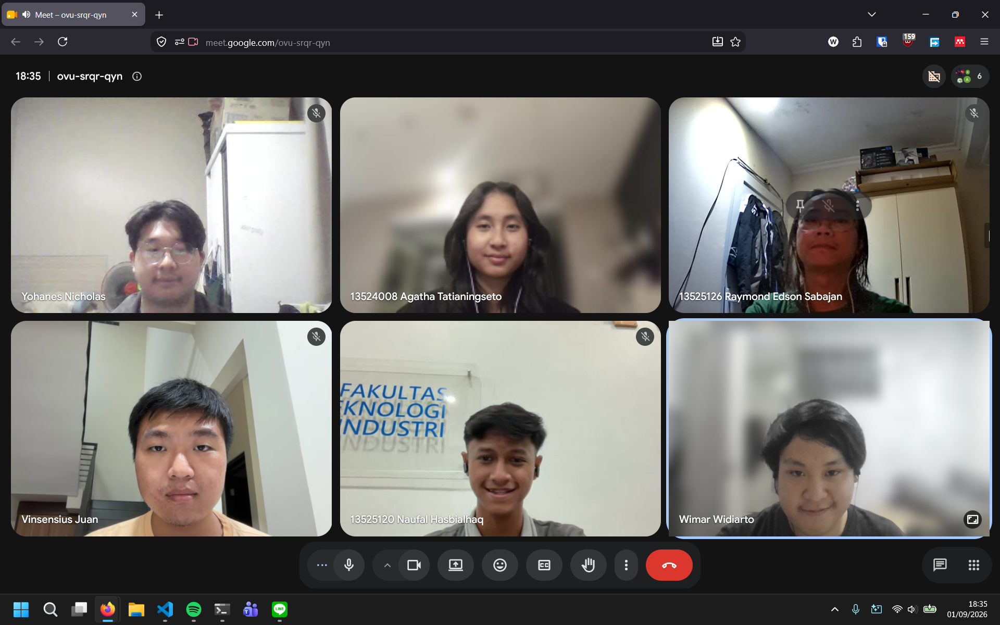

# Form Asistensi

## Tugas Besar IF2150 - Rekayasa Perangkat Lunak

| Informasi | Keterangan |
| --- | --- |
| **Hari** | Selasa |
| **Tanggal** | 01/09/2026 |
| **Kelas** | K03 |
| **Nomor Kelompok** | 09  |v
| **Nama Kelompok** | 9naga  |
| **Nama Perangkat Lunak** | *\[Nama P/L\]*  |
| **Dokumen** | K03_G09_TB  |

### Anggota Kelompok

| NIM | Nama |
| --- | --- |
| 13525120 | Naufal Hasbialhaq |
| 13525009 | Wimar Widiarto |
| 13525093 | Vinsensius Juan Setiady |
| 13525126 | Raymond Edson Sabajan |
| 13525048 | Yohanes Nicholas Setiawan |

### Catatan

| Catatan |
| --- |
| 1. Untuk bagian analisis kondisi saat ini, sebaiknya ditambahin apa yang sedang dilakukan orang-orang saat ini. Bagaimana mereka biasanya mencari pemberi jasa serupa? |
| 2. Untuk deskripsi perangkat lunak, perlu ditambahkan deskripsi yang lebih detail dan juga bentuk aplikasi (Mobile App, Website, dll) |
| 3. Untuk bagian asumsi dan batasan, bisa ditambah batasan dan asumsi teknis untuk perangkat lunak, seperti sistem operasi yang ditarget (iOS, Android, dll) |
| 4. Untuk diagram swimlane, dapat ditambahkan lane baru untuk sistem dan swimlane yang dibuat hanya harus memuat outcome yang diharapkan saja |
| 5. Bagian User story dapat menggunakan informasi dari wawancara agar dapat menambah fitur atau kebutuhan pelaku. |
| 6.  Deskripsi aktivitas saat ini tidak harus detail dan spesifik, hanya apa saja yang dapat dilakukan user |
| 7. Bagian referensi, dapat ditambahkan daftar pustaka untuk sumber yang digunakan dan juga bagian lampiran berisi link yang digunakan dalam pembuatan swimlane |

## Dokumentasi

  

  <i>Gambar 1. Dokumentasi kegiatan asistensi.</i>

