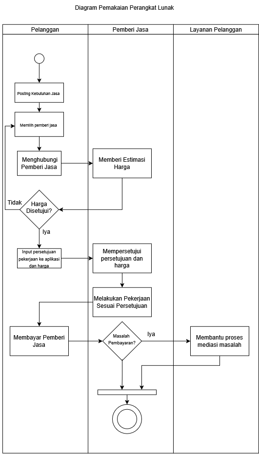

<h1>
IF2150 REKAYASA PERANGKAT LUNAK
 
TUGAS 1
 
TOPIC BRAINSTORMING
</h1>
 

## *Nama Perangkat Lunak*

### Untuk: Agatha

Dipersiapkan oleh:
| Informasi | Keterangan |
| --- | --- |
| Kelas | K03 |
| Kelompok | 9  |

| NIM | Nama |
|---|---|
| *13525120* | *Naufal Hasbialhaq* |
| *13525009* | *Wimar Widiarto* |
| *13525093* | *Vinsensius Juan Setiady* |
| *13525126* | *Raymond Edson Sabajan* |
| *13525048* | *Yohanes Nicholas Setiawan* |
---

 
 

# BAB 1: Analisis Permasalahan

## 1.1 Latar Belakang Masalah

Kesenjangan ekonomi dan ketidakpastian lapangan pekerjaan merupakan salah satu tantangan terbesar yang dihadapi negara Indonesia saat ini. PBB melalui Sustainable Development Goals(SDGs) telah menetapkan SDG ke-10 yaitu Reduced Inequalities sebagai salah satu cara untuk melakukan pembangunan global yang harus dicapai pada tahun 2030. SDG yang ke-10 secara khusus menargetkan peningkatan pendapatan 40% populasi terbawah melalui Target 10.1, pemberdayaan sosial dan ekonomi seluruh lapisan masyarakat tanpa diskriminasi melalui Target 10.2, serta penjaminan kesempatan yang setara dan pengurangan ketidaksetaraan hasil melalui Target 10.3. Ketiga target ini secara langsung berkaitan dengan kondisi pekerja informal di Indonesia yang hingga kini masih berada dalam posisi yang sangat rentan.

Berdasarkan data Badan Pusat Statistik pada tahun 2024, sekitar 57% dari total tenaga kerja di Indonesia masih bekerja di sektor pekerjaan informal. Sektor ini mencakup jutaan pekerja yang tidak memiliki kontrak kerja yang ril dan pasti, tidak mendapat jaminan sosial (gaji yang memadai, alias diatas umr), serta tidak memiliki perlindungan hukum yang memadai sebagaimana dicatat oleh International Labour Organization (ILO) pada tahun 2023. Kondisi ini diperparah dengan ketimpangan pendapatan yang masih signifikan, tercermin dari Gini Ratio Indonesia sebesar 0,379 pada tahun 2024. Pekerja di sektor informal rata-rata menerima upah 40 hingga 60 persen lebih rendah dibandingkan pekerja formal pada tingkat keahlian yang setara (ILO, 2023), sehingga kesenjangan ekonomi antara kelompok atas dan bawah terus melebar.

Di antara kelompok pekerja informal yang paling terdampak adalah para pekerja jasa skala kecil yang bergerak di berbagai bidang layanan masyarakat. Kelompok ini mencakup tukang listrik yang jumlahnya diperkirakan mencapai lebih dari 500.000 orang di seluruh Indonesia (APEI, 2023), tukang jahit yang mencapai sekitar 3,6 juta pekerja (Kementerian Perindustrian, 2022), serta pekerja cleaning service yang berjumlah sekitar 1,2 juta orang (BPS, 2023). Selain itu, terdapat pula pekerja handyman, tukang sol sepatu, tukang potong tanaman, dan jasa pest control yang perputaran industrinya saja mencapai sekitar Rp 2,4 triliun per tahun. Meskipun jumlahnya besar dan perannya sangat dibutuhkan dalam keseharian masyarakat, para pekerja di segmen-segmen ini sebagian besar belum memiliki platform yang dapat menghubungkan mereka secara langsung dengan konsumen.

Permasalahan yang mereka hadapi sangatlah mendasar. Dalam memperoleh klien, mereka hampir sepenuhnya bergantung pada promosi dari mulut ke mulut, tanpa memiliki saluran pemasaran yang mewadahi. Tidak adanya standar tarif yang jelas juga membuat mereka cukup rentan terhadap praktik tawar-menawar yang tidak sehat dan tekanan dari pihak calo atau perantara yang memotong pendapatan mereka secara tidak transparan. Lebih jauh, minimnya rekam jejak digital seperti portofolio kerja atau penilaian dari konsumen membuat kepercayaan pasar terhadap pekerja informal sulit terbentuk. Dari sisi perlindungan sosial, berdasarkan data BPJS Ketenagakerjaan tahun 2023 menunjukkan bahwa hanya sekitar 8,5 juta dari 75 juta pekerja informal yang terdaftar sebagai peserta, artinya sebagian besar dari mereka masih tidak memiliki akses terhadap jaminan kecelakaan kerja maupun jaminan kematian saat melakukan pekerjaannya.

    Dari sisi konsumen, ketidakhadiran sistem jasa yang terstandarisasi menimbulkan berbagai permasalahan tersendiri. Masyarakat yang membutuhkan jasa tukang listrik, tukang jahit, atau jasa kebersihan rumah seringkali mengalami kesulitan dalam menemukan pekerja yang dapat dipercaya, karena tidak tersedia mekanisme verifikasi identitas maupun keahlian yang memadai. Akibatnya, risiko penipuan dan ketidakkonsistenan kualitas layanan menjadi tinggi. Proses pencarian dan negosiasi yang tidak efisien juga menjadi hambatan, di mana konsumen harus menghubungi banyak pihak sebelum menemukan pekerja yang tersedia. Selain itu, seluruh transaksi umumnya dilakukan secara tunai tanpa bukti formal, sehingga tidak ada mekanisme perlindungan bagi kedua belah pihak apabila terjadi perselisihan.
    Berdasarkan penjelasan di atas, terdapat kesenjangan yang lumayan signifikan antara potensi tenaga kerja jasa dari pekerjaan informal di Indonesia dengan keterbatasan sistem yang ada untuk mempertemukan mereka dengan konsumen secara efisien, transparan, dan terlindungi. Oleh karena itu, pengembangan sebuah platform digital yang mengintegrasikan berbagai segmen jasa informal yang mencakup tukang listrik, handyman, tukang jahit, tukang sol sepatu, jasa potong tanaman, cleaning service, dan pest control menjadi sangat relevan dan mendesak, dan juga merupakan wujud nyata kontribusi teknologi dalam mendukung pencapaian SDG ke-10 di Indonesia.

## 1.2 Analisis Kondisi Saat Ini

Terdapat beberapa masalah pada sistem yang lama: 

<ul>
    <li>Kurangnya akses dan pelatihan pengetahuan digital dari sisi penjual jasa sehingga sedikitnya pemasaran dari jasa pekerjaan tersebut di internet/platform</li>
    <li>Platform yang mencakup dan menyediakan jasa dari pekerjaan ini masih belum merata(khususnya tukang sol sepatu dan penjahit)</li>
    <li>Konsumen kesulitan mencari penyedia jasa yang lokasinya dekat, karena tidak ada yang memiliki sistem berbasis lokasi yang spesifi pada jasa2 ini</li>
    <li>Prosesnya masih membebankan para konsumen untuk mencari para penyedia jasa</li>
    <li>Tidak adanya sistem maupun cara untuk mengecek reputasi dan ulasan dari hasil pekerjaan dan cara penyedia jasa menyelesaikan pekerjaanya </li>
</ul>

    Keterbatasan solusi yang sudah ada:    

    Pada aplikasi seekmi terdapat service pembersihan rumah, tetapi apa yang dilakukan masih berbasis waktu seperti pekerjaannya tuh hanya dikerjakan selama berapa jam alias tidak flexible.

---

# BAB 2: Analisis Solusi

## 2.1 Deskripsi Perangkat Lunak

Ketika pengguna membutuhkan suatu jasa spesifik yang bisa didapatkan dari para pekerja jasa informal (freelance), sering kali pengguna sulit mendapatkan informasi mengenai keberadaan para pekerja yang dapat membantunya. Sebaliknya, para pekerja jasa juga sering kali sulit untuk mendapatkan pelanggan karena ketidaktahuan pelanggan terhadap keberadaan para pekerja. Contohnya, seorang pengguna ingin menjahit pakaian mereka yang rusak namun tidak dapat menemukan lokasi penjahit yang dapat memperbaikinya. Oleh karena itu, kami ingin menghubungkan pengguna yang membutuhkan jasa dengan para pekerja yang membutuhkan pelanggan melalui sebuah platform aplikasi berbentuk mobile application. Platform mobile application dipilih karena perangkat mobile lebih mudah dijangkau oleh berbagai kalangan dan mudah bagi pekerja/pengguna jasa dalam melakukan mobilisasi.   
  Pelanggan:

<ol type="a" style= "margin-top: 0;">
    <li> Mengunggah dan memilih jasa</li>
    <li>Menghubungi pemilik jasa</li>
    <li>menginput persetujuan pekerjaan ke aplikasi dan harga</li>
    <li>Membayar pemilik jasa</li>
</ol>

Pemilik jasa:
<ol type="a" style= "margin-top: 0;">
    <li>Memberi estimasi harga</li>
    <li>Menyutujui persetujuan dan harga</li>
    <li>Melakukan pekerjaan</li>
</ol>
Layanan Pelanggan:
Membantu proses mediasi jika terdapat masalah, baik dari pembayaran atau yang lainnya

## 2.2 Asumsi dan Batasan

Asumsi:
a. Pengguna dan pekerja jasa memiliki smartphone
b. Pemilik jasa mengaktifkan GPS setiap menerima layanan jasa (jika memiliki smartphone)

Batasan:
a. Terdapat pengguna atau pemilik jasa yang tidak memiliki smartphone
b. Pengguna atau pemilik jasa yang kurang memiliki literasi digital
c. Pemilik jasa tidak dapat melakukan jasa yang ditawarkan

# BAB 3: Spesifikasi Kebutuhan dan Proses Bisnis

## 3.1 Identifikasi Aktor
Buatlah daftar seluruh aktor (pengguna) yang akan berinteraksi langsung dengan sistem solusi yang kalian kembangkan. Berikan penjelasan singkat mengenai peran dan karakteristik dari masing-masing aktor tersebut.

| Aktor | Deskripsi |
| :--- | :--- |
| Pemberi Jasa | Pengguna ini bertindak sebagai pihak penyedia jasa yang menerima pesanan, melakukan pekerjaan fisik di lokasi pelanggan, dan menyelesaikan tugas sesuai dengan persetujuannya dengan pelanggan.  |
|  Pelanggan| Pengguna ini berperan sebagai pihak yang memerlukan, memesan, dan membayar layanan jasa kasar. |
| Layanan Pelanggan | Pengguna ini sebagai pihak yang berjaga jaga apabila terdapat sebuah masalah pada sistem atau masalah pada pengguna lain |

## 3.2 Kebutuhan Pengguna Awal

| ID | Aktor | Kebutuhan / Aktivitas | Tujuan / Nilai |
| :--- | :--- | :--- | :--- |
| US-01 | Pemberi Jasa |  Melakukan pekerjaan fisik di lokasi pelanggan sesuai dengan persetujuan dengan pelanggan  | Menjual jasa untuk mendapatkan upah  |
| US-02 | Pelanggan | Pihak yang memerlukan, memesan, dan membayar layanan jasa | Menyelesaikan masalah yang dimiliki oleh pelanggan|
| US-03 | Layanan Pelanggan | menyelesaikan permasalahan yang terjadi dalam aktivitas pemberi dan penerimaan jasa | Menyelesaikan permasalahan yang terjadi antara pihak Pemberi Jasa dan Pelanggan |

## 3.3 Deskripsi Aktivitas
Buatlah daftar seluruh aktivitas yang terdapat dalam sistem solusi, lengkap dengan ID dan penjelasan. Telusuri hubungan aktivitas tersebut dengan *user story* yang sudah dituliskan sebelumnya. Bisa dibuat dalam bentuk tabel.
| ID | Aktivitas | Penjelasan | ID User Story |
| :--- | :--- | :--- | :--- |
| A01 | Mendaftarkan Kebutuhan Jasa | Pelanggan memasukkan informasi pekerjaan. | US-01 |
| A02 | Mengambil Pekerjaan | Pemberi jasa mendaftarkan diri untuk kebutuhan jasa pelanggan | US-02 |
| A03 | Negosiasi Harga| pelanggan dan pemberi jasa bernegosiasi harga dari tingkat intensitas pekerjaan yang dilakukan | US-01 US-02 |
| A04 | Input Persetujuan Pekerjaan | Pelanggan memasukkan persetujuan pekerjaan dan harga yang akan dibayarkan | US-01 |
| A05 | Menyelesaikan Pekerjaan | Pemberi jasa melaporkan selesainya pekerjaan yang dilakukan | US-02 |
| A06 | Rating | Pelanggan memberikan rating akan pekerjaan yang dilakukan pemberi jasa dan sebaliknya| US-01 US-02 |
| ... | ... | ... | ... |

## 3.4 Model Proses Bisnis
 

<i>Gambar 1. Diagram Swimlane Pemakaian Aplikasi</i>

 

# Referensi
<ol type="1">
    <li>https://www.un.org/sustainabledevelopment/inequality/</li>
    <li>https://www.bps.go.id/id/pressrelease/2024/11/05/2373/tingkat-pengangguran-terbuka--tpt--sebesar-4-91-persen-.html </li>
    <li>https://ilostat.ilo.org/data/country-profiles/idn/</li>
    <li>https://kemnaker.go.id/news/detail/kemnaker-terus-berupaya-tingkatkan-kepesertaan-bpjs-ketenagakerjaan-sektor-informal</li>
    <li>https://www.bpjsketenagakerjaan.go.id/berita/29210/BPJS-Ketenagakerjaan-fokus-perbesar-kepesertaan-pekerja-informal</li>
    <li>https://money.kompas.com/read/2015/03/23/174916926/Di.Indonesia.Listrik.Tetap.Menjadi.Kebutuhan</li>
    <li>https://kendellpestcontrol.com/perputaran-bisnis-industri-pengendalian-hama-capai-rp-2-triliun/</li>
    <li>https://www.bps.go.id</li>
    <li>https://www.tempo.co/ekonomi/kemenperin-beberkan-jumlah-tenaga-kerja-di-industri-tekstil-turun-7-5-persen-apa-pemicunya--28235</li>
</ol>

# Lampiran

Link Diagram Swimlane: https://drive.google.com/file/d/1scSgZxWXoRtN6_0zALDt6Y6UHu9jHHPn/view?usp=sharing

