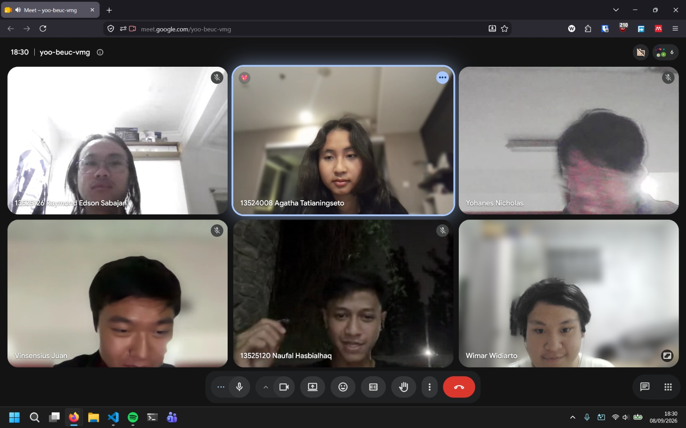

# Form Asistensi

## Tugas Besar IF2150 - Rekayasa Perangkat Lunak

| Informasi | Keterangan |
| --- | --- |
| **Hari** | *Senin* |
| **Tanggal** | *08/09/2026* |
| **Kelas** | *K3* |
| **Nomor Kelompok** | *9*  |
| **Nama Kelompok** | *9Naga*  |
| **Nama Perangkat Lunak** | *Cari Uang*  |
| **Dokumen** | *K03_G09_RG.md*  |

### Anggota Kelompok

| NIM | Nama |
| --- | --- |
| 13525120 | Naufal Hasbialhaq |
| 13525009 | Wimar Widiarto |
| 13525093 | Vinsensius Juan Setiady |
| 13525126 | Raymond Edson Sabajan |
| 13525048 | Yohanes Nicholas Setiawan |

### Catatan

| Catatan |
| --- |
| 1. ⁠A01 - Bisa dibuat pemesanan jasa berdasarkan daftar jasa yang ada  |
| 2.⁠ ⁠Buat aktivitas yg fiks dulu sebelum buat kebutuhan biarin ga ketuker-tuker/kedobelan. Pada bagian 2 deskripsi kebutuhan(beneran jabarin setiap fitur: login, logout, ganti password, dll) itu pake EARS dan subjek di depan( user dapat ...) |
| 3. Untuk kebutuhan bisnis itu nanti pake sumber pustaka dan juga makesure legal. |
| 4. Knf. Gimana sinkronisasi gmn jika kyk ada maksimal pekerjaan setiap pemberi jasa(3) kalo udh ada 2 dan ada 2 org kirim kebutuhan bersamaan sistem handlingnya gimana. Jelaskan juga enkripsinya gmn |
| 5. 2.4 ID kebutuhan itu pake RXX bukan AXX |
| 6. KNF dan KF ini berfokus pada sistem dan bagaimana ia repson input user. Pake "kalimat P/L dapat ..." untuk penjelasan. 1 KFXX bisa |
| 7. Referensi bisa dipisah jadi daftar pustaka (bagian bisnis) & lampiran(kalau ada) |
| 8. Kebutuhan bisnis kyk enkripsi itu cari uu yg berhubungan dengannya agar legal. Pembayaran jg bs kyk harus memenuhi uu apa |

**Notes for this section:**  
*Catatan dapat dituliskan dalam bentuk paragraf atau poin-poin, disesuaikan saja.* 

## Dokumentasi

<!--  -->

  

  <i>Gambar 1. Dokumentasi kegiatan asistensi.</i>

