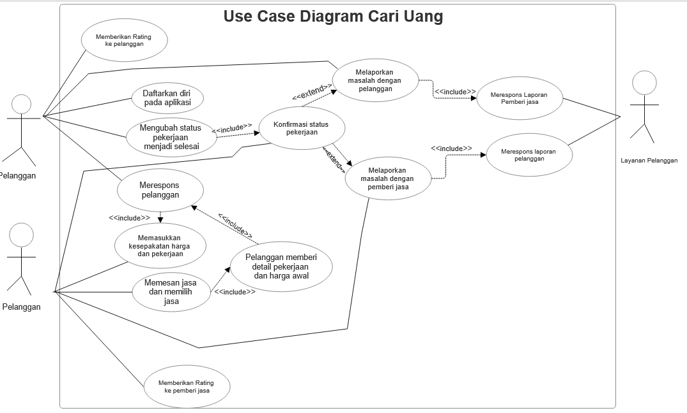

<h1>
IF2150 REKAYASA PERANGKAT LUNAK
 
TUGAS 3
 
USE CASE & SCENARIO USE CASE
</h1>
 

## Cari Uang

### Untuk: Agatha Tatianingseto

Dipersiapkan oleh:
| Informasi | Keterangan |
| --- | --- |
| Kelas | K03 |
| Kelompok | 9  |

| NIM | Nama |
|---|---|
| *13525120* | *Naufal Hasbialhaq* |
| *13525009* | *Wimar Widiarto* |
| *13525093* | *Vinsensius Juan Setiady* |
| *13525126* | *Raymond Edson Sabajan* |
| *13525048* | *Yohanes Nicholas Setiawan* |

## Daftar Perubahan

| Revisi | Deskripsi |
| :--- | :--- |
| *A* | *Revisi pada Kebutuhan Fungsional karena ada beberapa kebutuhan yang tumpang tindih* |
| *B* |  |
| *C* |  |
| ... |  |

 
 

# BAB 1: Deskripsi Perangkat Lunak

 "CariUang" adalah suatu perangkat lunak berbasis *mobile application* pada sistem operasi Android yang menjadi jembatan antara pekerja jasa (freelance) dan pengguna yang ingin menggunakan jasa mereka. Perangkat lunak ini memungkinkan pengguna untuk mengunggah kebutuhan jasa dan memilih jasa mereka. Kemudian, pemilik jasa dapat terhubung dengan pengguna untuk memberikan estimasi harga. Jika harga disetujui, pengguna akan menginput persetujuan/deskripsi pekerjaan dan harga ke apikasi sebelum disetujui oleh pemilik jasa. Jika tidak disetujui, pengguna akan kembali memilih pemilik jasa yang lain. Setelah itu, pemilik jasa akan melakukan pekerjaan sesuai persetujuan/deskripsi pekerjaan. Setelah semua pekerjaan selesai, pengguna akan membayar harga yang telah ditetapkan sebelumnya.  

 Jika pengguna bingung akan pekerja jasa mana yang memiliki performa terbaik mengenai salah satu pekerjaan spesifik, perangkat lunak ini memiliki sistem rekomendasi pemilik jasa yang dikelompokkan kepada berbagai kelompok pekerjaan. Pengguna kemudian dapat langsung menghubungi pemilik jasa untuk menggunakan jasa mereka. 

 Di dalam perangkat lunak yang kami buat, terdapat sistem *rating* untuk memberi penilaian terhadap kinerja pemilik jasa dan perilaku pengguna jasa. Rating diberikan oleh pengguna kepada pemilik jasa dan begitupun sebaliknya, sehingga baik pengguna atau pemilik jasa harus memberikan pelayanan atau perilaku yang terbaik untuk menjaga rating mereka. Jika rating melewati batas bawah yang telah ditentukan, baik pemilik atau pengguna jasa akan mendapatkan sanksi tertentu.  

 Jika pengguna atau pemilik jasa memiliki beberapa keluhan yang tidak dapat diselesaikan antara kedua belah pihak, pengguna dapat membuat aduan kepada pihak Customer Service untuk ditindaklanjuti. Pengguna dapat mengirim tiket laporan mengenai berbagai topik spesifik dengan cara mengisi suatu form yang terdapat di menu Laporan. Setelah tiket dikirim, pihak Customer Service kemudian akan meninjau laporan tersebut untuk mencari langkah penyelesaian yang paling baik. Setelah selesai, pihak Customer Service akan memberikan tanggapan kepada pelapor mengenai hal yang telah dilakukan atau tindakan lanjutan yang perlu dilakukan.  

  

---

# BAB 2: Kebutuhan Fungsional (KF)
Salin ulang **seluruh Kebutuhan Fungsional (KF)** yang telah didefinisikan pada dokumen *Requirement Gathering*. Tabel ini menjadi acuan *traceability*, dimana setiap Use Case pada BAB 3 wajib ditelusuri ke satu atau lebih ID KF di tabel ini, dan sebaliknya setiap KF idealnya tercakup oleh minimal satu Use Case. Pastikan juga sudah menggunakan **format EARS** dalam penulisan KF.

| ID KF | Kebutuhan | Penjelasan |
| :--- | :--- | :--- |
| KF01 | Menampilkan daftar jasa | Perangkat lunak dapat menampilkan halaman utama berisi daftar kategori dan jasa yang tersedia ketika pelanggan membuka aplikasi. |
| KF02 | Pemesanan jasa | Perangkat lunak harus menyediakan fitur pemesanan jasa yang dapat digunakan pelanggan untuk memilih dan memesan jasa yang diinginkan. |
| KF03 | Menampilkan lokasi pemberi jasa | Perangkat lunak harus menampilkan lokasi (dalam bentuk peta) pemberi jasa beserta informasi jarak dari posisi pelanggan saat ini. |
| KF04 | Menyediakan form pendaftaran | Perangkat lunak harus menyediakan formulir pendaftaran bagi pemberi jasa untuk mengisi data diri dan jenis jasa yang akan ditawarkan. |
| KF05 | Menyimpan data pemberi jasa | Perangkat lunak harus menyimpan seluruh data pemberi jasa yang telah mendaftar ke dalam basis data. |
| KF06 | Notifikasi pesanan | Perangkat lunak harus menampilkan notifikasi pesanan yang masuk pada tampilan pemberi jasa agar dapat segera ditanggapi. |
| KF07 | Pembatalan pesanan | Perangkat lunak membatalkan pesanan secara otomatis apabila pemberi jasa tidak menerima pesanan dalam rentang waktu 30 menit sejak notifikasi dikirim. |
| KF08 | Halaman detail pemberi jasa | Perangkat lunak menampilkan halaman detail yang memuat informasi lengkap mengenai jasa dan lokasi pemberi jasa kepada pelanggan. |
| KF09 | Fitur komunikasi pelanggan dan pemberi jasa | Perangkat lunak harus menyediakan fitur komunikasi antara pemberi jasa dan pelanggan untuk keperluan negosiasi harga sebelum pekerjaan dimulai. |
| KF10 | Form kesepakatan harga dan pekerjaan | Perangkat lunak harus menyediakan form input bagi pelanggan untuk memasukkan detail kesepakatan pekerjaan dan harga yang telah disetujui bersama. |
| KF11 | Mengubah status pekerjaan | Perangkat lunak harus menerima input kesepakatan pekerjaan dan harga, lalu mengubah status pekerjaan secara otomatis menjadi 'On Process'. |
| KF12 | Fitur mengubah status pekerjaan bagi pemberi jasa | Perangkat lunak harus menyediakan tombol atau fitur bagi pemberi jasa untuk melaporkan kepada pelanggan bahwa pekerjaan telah selesai dilaksanakan. |
| KF13 | Fitur mengonfirmasi status pekerjaan bagi pelanggan | Perangkat lunak harus menyediakan tombol konfirmasi bagi pelanggan untuk menerima laporan penyelesaian, melakukan pembayaran, dan mengubah status pekerjaan menjadi 'Done'. |
| KF14 | Pelanggan melaporkan masalah | Perangkat lunak harus menyediakan fitur bagi pelanggan untuk melaporkan masalah yang dialami selama proses penggunaan jasa kepada layanan pengguna. |
| KF15 | Ruang komunikasi pelanggan dan layanan pelanggan | Perangkat lunak harus membuat tiket laporan secara otomatis dan menyediakan ruang komunikasi antara pelanggan dan layanan pengguna untuk penyelesaian masalah. |
| KF16 | Pemberi jasa melaporkan masalah | Perangkat lunak harus menyediakan fitur bagi pemberi jasa untuk melaporkan masalah yang dialami selama proses pengerjaan jasa kepada layanan pengguna. |
| KF17 | Ruang komunikasi pemberi jasan dan layanan pelanggan | Perangkat lunak membuat tiket laporan secara otomatis dan menyediakan ruang komunikasi antara pemberi jasa dan layanan pengguna untuk penyelesaian masalah. |
| KF18 | Notifikasi tiket laporan  | Perangkat lunak harus mengirimkan notifikasi kepada layanan pelanggan setiap kali ada tiket laporan baru yang masuk dari pelanggan maupun pemberi jasa. |
| KF19 | Fitur rating | Perangkat lunak harus menyediakan fitur penilaian dua arah yang memungkinkan pelanggan dan pemberi jasa saling memberikan rating setelah pekerjaan selesai. |
| KF20 | Menyimpan data rating | Perangkat lunak harus menyimpan data rating yang diberikan, mengakumulasikan seluruh nilai, dan menghitung rata-rata rating untuk ditampilkan pada profil masing-masing pengguna. |
| KF21 | Fitur pendaftaran dan login aplikasi | Perangkat lunak menyediakan fitur pendaftaran dan login pada aplikasi untuk pelanggan, pemberi jasa, serta layanan pelanggan |

 ***Catatan***: *Jika ada KF dari ML2 yang berubah/bertambah/dihapus setelah asistensi, pastikan tabel ini konsisten dengan versi KF terbaru sebelum dikumpulkan.*

---

# BAB 3: Model Use Case

## 3.1 Identifikasi Aktor
Daftarkan seluruh aktor yang terlibat dalam use case yang akan dimodelkan. Aktor berupa pengguna manusia yang berinteraksi dengan solusi. Perlu diperhatikan bahwa Admin/Developer/ Pihak Eksternal lain yang bisa diotomisasi, tidak perlu dijadikan aktor.

| Aktor | Deskripsi |
| :--- | :--- |
| Pemberi Jasa | Pengguna ini bertindak sebagai pihak penyedia jasa yang menerima pesanan, melakukan pekerjaan fisik di lokasi pelanggan, dan menyelesaikan tugas sesuai dengan persetujuannya dengan pelanggan.  |
|  Pelanggan| Pengguna ini berperan sebagai pihak yang memerlukan, memesan, dan membayar layanan jasa kasar. |
| Layanan Pelanggan | Pengguna ini sebagai pihak yang berjaga jaga apabila terdapat sebuah masalah pada sistem atau masalah pada pengguna lain |

## 3.2 Identifikasi Use Case
Identifikasi seluruh use case yang mencakup Kebutuhan Fungsional pada BAB 2. Satu use case boleh mencakup lebih dari satu KF, dan sebaliknya satu KF boleh muncul di lebih dari satu use case bila memang relevan.

| ID UC | Nama Use Case | Deskripsi Singkat | Aktor Terlibat | ID KF Terkait |
| :--- | :--- | :--- | :--- | :--- |
| UC01 | Mendaftarkan jasa | Pemberi jasa mendaftarkan diri pada aplikasi terkait jasa yang akan diberikan | Pemberi jasa | KF04, KF05 |
| UC02 | Memilih jasa | Pelanggan memilih jasa yang tersedia dan sesuai dengan kebutuhannya | Pelanggan | KF01 |
| UC03 | Menghubungi pemberi jasa  | Pelanggan mengirimkan pesan kepada pemberi jasa mengenai detail pekerjaannya dan harga awal yang ditawarkan | Pelanggan | KF09 |
| UC04 | Merespon pelanggan | Pemberi jasa merespon pelanggan, bisa berupa tawaran harga lain, menyetujui, atau menolak tawaran dari pelanggan  | Pemberi jasa | KF09 |
| UC05 | Memasukkan kesepakatan harga dan pekerjaan | Pelanggan memasukkan detail kesepakatan harga dan pekerjaan kepada aplikasi dan aplikasi merubah status pekerjaan menjadi 'On Progress'  | Pelanggan | KF10, KF11 |
| UC06 | Mengonfirmasi mengenai status pekerjaan  | Pemberi jasa menekan tombol atau fitur lainnya pada aplikasi bahwa pekerjaan telah selesai dan menunggu konfirmasi dari pelanggan | Pemberi jasa | KF12 |
| UC07 | Mengonfirmasi pekerjaan  | Pelanggan mengonfirmasi pemberi jasa mengenai status pekerjaan | Pelanggan | KF13 |
| UC08 | Melaporkan masalah  | Pelanggan dan pemberi jasa melaporkan ketika ada masalah kepada layanan pelanggan saat proses penggunaan jasa| Pelanggan, Pemberi jasa | KF14, KF15 |
| UC09 | Merespon laporan masalah  | Layanan pengguna merespon masalah yang diajukan pelanggan atau pemberi masalah | Layanan Pelanggan | KF15, KF18, KF17 |
| UC10 | Memberi rating  | Pelanggan dan pemberi jasa saling memberi rating satu sama lain | Pelanggan, Pemberi jasa | KF19, KF20 |
| UC11 | Mendaftar atau masuk ke perangkat lunak  | Layanan pelanggan, pelanggan, pemberi jasa dapat melakukan pendaftaran akun atau masuk ke perangkat lunak dengan akun yang sudah ada | Pelanggan, Pemberi Jasa, Layanan Pelanggan | KF21 |

| *...* | *...* | *...* | *...* | *...* |

## 3.3 Use Case Diagram 
Buatlah **satu** use case diagram yang mencakup seluruh aktor dan use case. Sertakan relasi *include*/*extend* apabila ada use case yang saling bergantung.
 

<i>Gambar 1. Use Case Diagram</i>

 

Hal-hal yang perlu diperhatikan dalam pembuatan use case diagram:
- Pastikan notasi UML use case (aktor, oval use case, garis asosiasi, *include/extend*) digambar dengan benar.
- Seluruh aktor dan use case yang telah didefinisikan harus muncul di diagram, tidak ada yang terlewat maupun berlebih.
- Hindari garis yang saling bersilangan tanpa alasan jelas, susun diagram agar mudah dibaca.
- Hindari istilah solusi teknis (misalnya nama tabel database, nama endpoint API) muncul di dalam diagram use case karena use case menjelaskan *interaksi fungsional*, bukan detail implementasi.

## 3.4 Skenario Use Case
Buat skenario untuk **setiap** use case yang telah diidentifikasi pada 3.2. Setiap skenario dapat terdiri dari dua jenis alur:
- **Skenario Normal**: alur utama (*happy path*) di mana interaksi aktor-sistem berjalan lancar tanpa kendala hingga tujuan use case tercapai.
- **Skenario Alternatif**: alur percabangan dari skenario normal, misalnya kondisi gagal, input tidak valid, atau pilihan lain yang tersedia bagi aktor. Boleh ada lebih dari satu skenario alternatif per use case jika ada beberapa titik percabangan berbeda.

Format tabel skenario: kolom **Aksi Aktor** berisi apa yang dilakukan/diinput aktor, kolom **Reaksi Perangkat Lunak** berisi respons sistem terhadap aksi tersebut secara **berurutan** (nomor langkah harus berpasangan/selaras antar dua kolom).

### 3.4.1 Skenario UC01

**Nama Use Case:** *Pemberi jasa mendaftarkan jasa*

**Skenario Normal**

| No | Aksi Aktor | Reaksi Perangkat Lunak |
| :--- | :--- | :--- |
| 1 | *Pemberi jasa menekan tombol daftar jasa dan mengisi formulir* | *Sistem menampilkan formulir untuk mendaftarkan jasa* |
| 2 | *Pelanggan mengunggah formulir pendaftaran jasa* | *Sistem memverifikasi data yang dikirimkan dan memperbarui data pemberi jasa* |

 

**Skenario Alternatif 1: Verifikasi Input Gagal**

| No | Aksi Aktor | Reaksi Perangkat Lunak |
| :--- | :--- | :--- |
| 1 | *Pemberi jasa menekan tombol daftar jasa dan mengisi formulir* | *Sistem menampilkan formulir untuk mendaftarkan jasa* |
| 2 | *Pemberi jasa mengunggah formulir pendaftaran jasa* | *Sistem memverifikasi data yang dikirimkan dan menerima verifikasi gagal* |
| 3 | *Pemberi jasa mengisi formulir ulang* | *Sistem kembali ke langkah 1 skenario normal* |

### 3.4.2 Skenario UC02

**Nama Use Case:** *Pelanggan memilih dan memesan jasa*

**Skenario Normal**

| No | Aksi Aktor | Reaksi Perangkat Lunak |
| :--- | :--- | :--- |
| 1 | *Pelanggan menekan tombol menu untuk mencari jasa* | *Sistem menampilkan daftar jasa yang dapat dipesan* |

 

**Skenario Alternatif 1: Pemberi jasa tidak ditemukan**

| No | Aksi Aktor | Reaksi Perangkat Lunak |
| :--- | :--- | :--- |
| 1 | *Pelanggan mencari jasa yang tidak terdaftar di dalam sistem* | *Sistem menampilkan pesan "Jasa yang kamu inginkan tidak tersedia" dan meminta pelanggan untuk memasukkan kembali jasa yang diinginkan* |

### 3.4.5 Skenario UC05

**Nama Use Case:** Pelanggan memasukkan kesepakatan harga dan pekerjaan

**Skenario Normal**

| No | Aksi Aktor | Reaksi Perangkat Lunak |
| :--- | :--- | :--- |
| 1 | Layanan Pelanggan menerima sebuah notifikasi dan membuka notifikasi tersebut | Sistem menampilkan tiket layanan yang telah diisi oleh pelanggan |
| 2 | Layanan Pelanggan mengisi form balasa terkait masalah yang dihadapi oleh pelanggan | Sistem menyimpan data dari form yang diisi oleh layanan pelanggan |
| 3 | Layanan Pelanggan mengirim form yang telah diisi tadi | Sistem mengirim form yang telah diisi oleh layanan pelanggan dan memberikan notifikasi kepada pelanggan yang melaporkan masalahnya |

### 3.4.6 Skenario UC06

**Nama Use Case:** Pemberi jasa telah selesai bekerja

**Skenario Normal**

| No | Aksi Aktor | Reaksi Perangkat Lunak |
| :--- | :--- | :--- |
| 1 | Penyedia jasa menekan tombol bantuan layanan pengguna | Sistem menampilkan form tiket pengajuan bantuan |
| 2 | Penyedia jasa mengisi form dengan kriteria yang tertera di form | Sistem mencatat semua data dari form yang diisi |
| 3 | Penyedia jasa menekan tombol kirim pada bagian bawah form yang sudah diisi tadi | Sistem mengirim form yang telah diisi tadi ke layanan pengguna |

 

### 3.4.9 Skenario UC9
**Nama Use Case:** Layanan pelanggan merespon pelanggan

**Skenario Normal**

| No | Aksi Aktor | Reaksi Perangkat Lunak |
| :--- | :--- | :--- |
| 1 | Layanan Pelanggan menerima sebuah notifikasi dan membuka notifikasi tersebut | Sistem menampilkan tiket layanan yang telah diisi oleh penyedia jasa |
| 2 | Layanan Pelanggan mengisi form balasa terkait masalah yang dihadapi oleh penyedia jasa | Sistem menyimpan data dari form yang diisi oleh layanan pelanggan |
| 3 | Layanan Pelanggan mengirim form yang telah diisi tadi | Sistem mengirim form yang telah diisi oleh layanan pelanggan dan memberikan notifikasi kepada penyedia jasa yang melaporkan masalahnya |

 

### 3.4.12 Skenario UC12
**Nama Use Case:** 	Pelanggan memberi rating

**Skenario Normal**

| No | Aksi Aktor | Reaksi Perangkat Lunak |
| :--- | :--- | :--- |
| 1 | Pelanggan mengisi sebuah form berbentuk popup yang muncul ketika penyedia jasa telah mengonfirmasi bahwa biaya jasa telah dibayarkan | Menyimpan data dari rating yang diisi pengguna |
| 2 | Pelanggan menekan tombol kirim | Sistem menyimpan data di dalam database |

 

### 3.4.13 Skenario UC13
**Nama Use Case:** Pemberi jasa memberi rating

**Skenario Normal**

| No | Aksi Aktor | Reaksi Perangkat Lunak |
| :--- | :--- | :--- |
| 1 | Penyedia Jasa mengisi sebuah form berbentuk popup yang muncul ketika penyedia jasa telah mengonfirmasi bahwa biaya jasa telah dibayarkan | Menyimpan data dari rating yang diisi pengguna |
| 2 | Penyedia jasa menekan tombol kirim | Sistem menyimpan data di dalam database |

*Lanjutkanlah pola 3.4.x ini untuk setiap ID UC yang telah diidentifikasi pada 3.2, sampai seluruh use case memiliki skenario normal dan skenario alternatif (tidak usah dibuat jika use case tersebut memang tidak memiliki skenario alternatif).*
