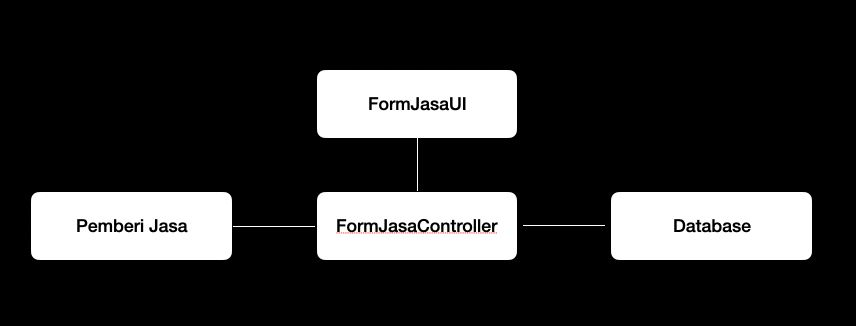
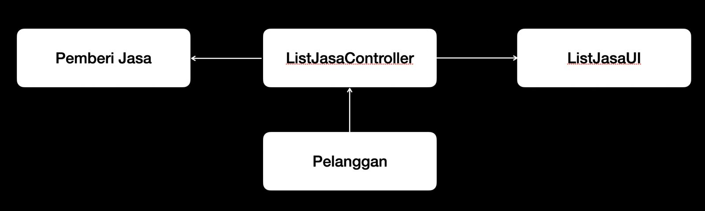
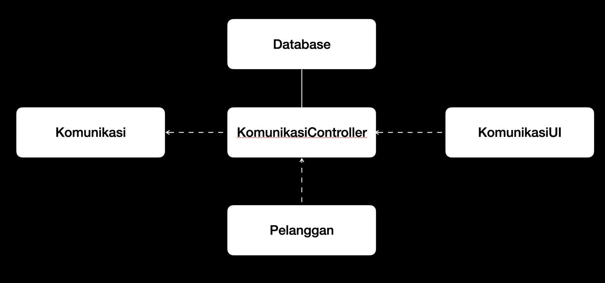
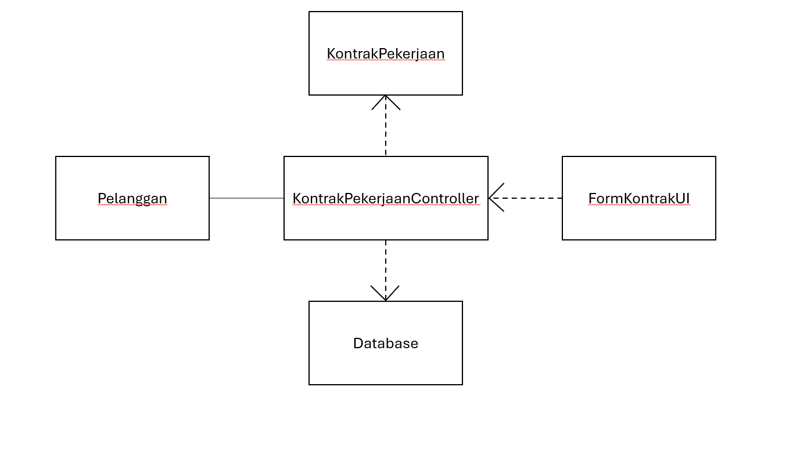
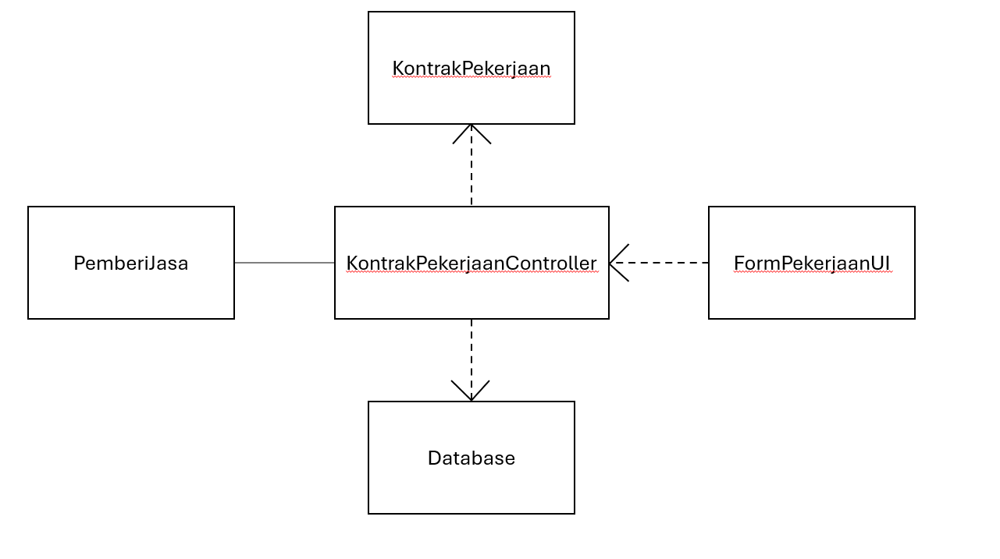
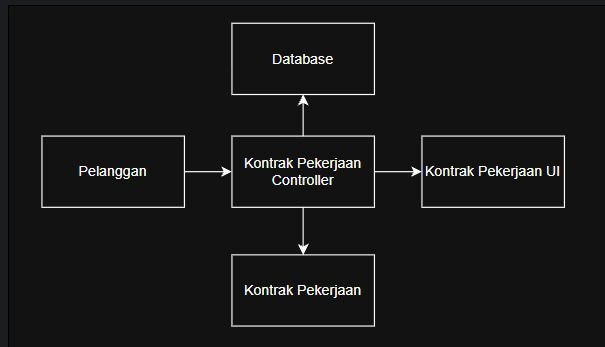
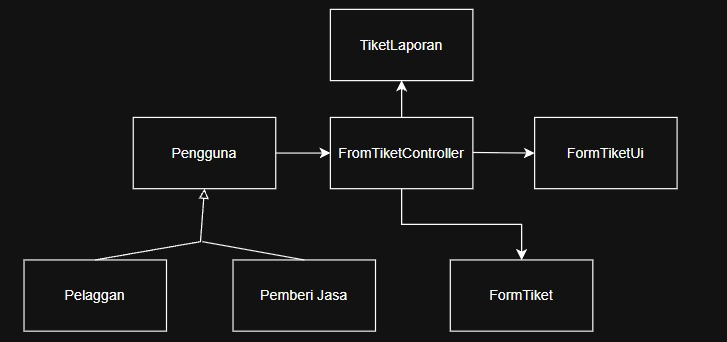
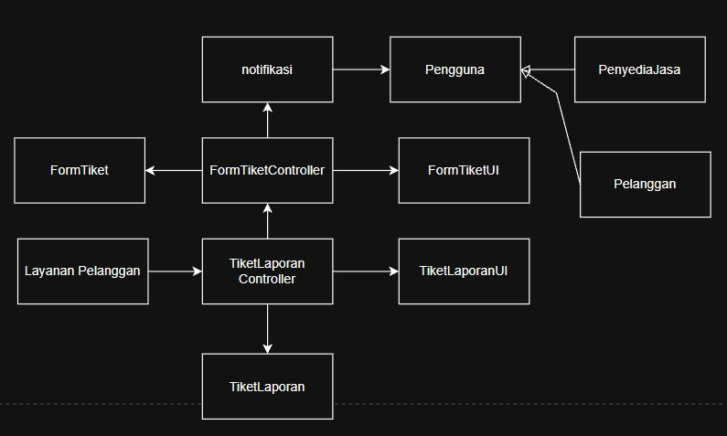
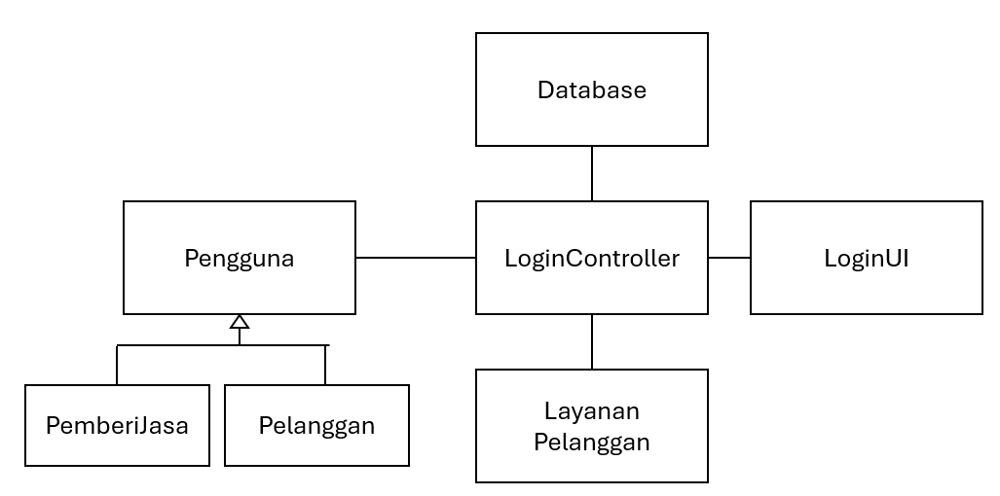
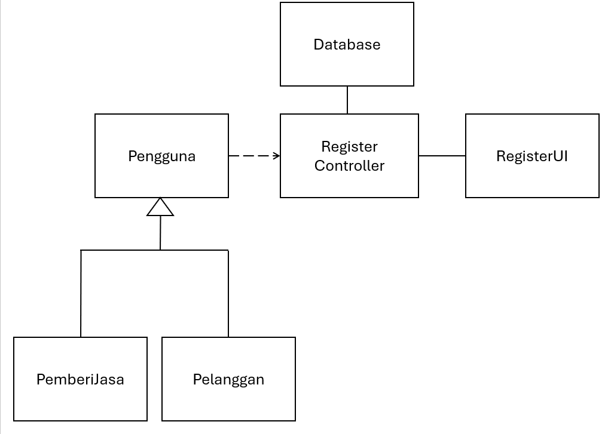

<h1>
IF2150 REKAYASA PERANGKAT LUNAK
 
TUGAS 4
 
CLASS DIAGRAM
</h1>
 

## Cari Uang

### Untuk: Agatha Tatianingseto

Dipersiapkan oleh:
| Informasi | Keterangan |
| --- | --- |
| Kelas | K03 |
| Kelompok | 9  |

| NIM | Nama |
|---|---|
| *13525120* | *Naufal Hasbialhaq* |
| *13525009* | *Wimar Widiarto* |
| *13525093* | *Vinsensius Juan Setiady* |
| *13525126* | *Raymond Edson Sabajan* |
| *13525048* | *Yohanes Nicholas Setiawan* |
---

## Daftar Perubahan

| Revisi | Deskripsi |
| :--- | :--- |
| *A* | *Perubahan pada skenario UC02, UC03, dan UC04. Pada UC02, ditambahkan skenario mengubah ketersediaan pemberi jasa. Pada UC03 dan UC04, ditambahkan skenario pemberi jasa atau pelanggan membuka kanal komunikasi. |
| *B* | *Mengubah struktur UC10-UC11 agar lebih mudah dibaca* |
| *C* |  |
| ... |  |

 
 

# BAB 1: Deskripsi Perangkat Lunak

 "CariUang" adalah suatu perangkat lunak berbasis *mobile application* pada sistem operasi Android yang menjadi jembatan antara pekerja jasa (freelance) dan pengguna yang ingin menggunakan jasa mereka. Perangkat lunak ini memungkinkan pengguna untuk mengunggah kebutuhan jasa dan memilih jasa mereka. Kemudian, pemilik jasa dapat terhubung dengan pengguna untuk memberikan estimasi harga. Jika harga disetujui, pengguna akan menginput persetujuan/deskripsi pekerjaan dan harga ke apikasi sebelum disetujui oleh pemilik jasa. Jika tidak disetujui, pengguna akan kembali memilih pemilik jasa yang lain. Setelah itu, pemilik jasa akan melakukan pekerjaan sesuai persetujuan/deskripsi pekerjaan. Setelah semua pekerjaan selesai, pengguna akan membayar harga yang telah ditetapkan sebelumnya.  

 Jika pengguna bingung akan pekerja jasa mana yang memiliki performa terbaik mengenai salah satu pekerjaan spesifik, perangkat lunak ini memiliki sistem rekomendasi pemilik jasa yang dikelompokkan kepada berbagai kelompok pekerjaan. Pengguna kemudian dapat langsung menghubungi pemilik jasa untuk menggunakan jasa mereka. 

 Di dalam perangkat lunak yang kami buat, terdapat sistem *rating* untuk memberi penilaian terhadap kinerja pemilik jasa dan perilaku pengguna jasa. Rating diberikan oleh pengguna kepada pemilik jasa dan begitupun sebaliknya, sehingga baik pengguna atau pemilik jasa harus memberikan pelayanan atau perilaku yang terbaik untuk menjaga rating mereka. Jika rating melewati batas bawah yang telah ditentukan, baik pemilik atau pengguna jasa akan mendapatkan sanksi tertentu.  

 Jika pengguna atau pemilik jasa memiliki beberapa keluhan yang tidak dapat diselesaikan antara kedua belah pihak, pengguna dapat membuat aduan kepada pihak Customer Service untuk ditindaklanjuti. Pengguna dapat mengirim tiket laporan mengenai berbagai topik spesifik dengan cara mengisi suatu form yang terdapat di menu Laporan. Setelah tiket dikirim, pihak Customer Service kemudian akan meninjau laporan tersebut untuk mencari langkah penyelesaian yang paling baik. Setelah selesai, pihak Customer Service akan memberikan tanggapan kepada pelapor mengenai hal yang telah dilakukan atau tindakan lanjutan yang perlu dilakukan.  

  

---

# BAB 2: Kebutuhan Fungsional

## 2.1 Kebutuhan Fungsional

Salin ulang seluruh Kebutuhan Fungsional (KF) yang telah dirumuskan pada dokumen sebelumnya, lengkap dengan ID KF, ID Kebutuhan (mengacu ke ID pada tabel Pemetaan Kebutuhan di dokumen *Requirement Gathering*), dan penjelasannya.

Pada bagian ini, Anda diperbolehkan untuk menyalin dari dokumen sebelumnya.

 ***Catatan***: *Kebutuhan ditulis mengikuti pola EARS. Pada contoh di bawah, sebagian besar KF dipicu oleh satu aksi pelanggan, sehingga memakai pola event-driven "Ketika ⟨pemicu⟩, sistem harus ⟨respons⟩".*

Tabel 2.1. Daftar Kebutuhan Fungsional

| ID KF | Kebutuhan | Penjelasan |
| :--- | :--- | :--- |
| KF01 | Menampilkan daftar jasa | Perangkat lunak dapat menampilkan halaman utama berisi daftar kategori dan jasa yang tersedia ketika pelanggan membuka aplikasi. |
| KF02 | Pemesanan jasa | Perangkat lunak harus menyediakan fitur pemesanan jasa yang dapat digunakan pelanggan untuk memilih dan memesan jasa yang diinginkan. |
| KF03 | Menampilkan lokasi pemberi jasa | Perangkat lunak harus menampilkan lokasi (dalam bentuk peta) pemberi jasa beserta informasi jarak dari posisi pelanggan saat ini. |
| KF04 | Menyediakan form pendaftaran | Perangkat lunak harus menyediakan formulir pendaftaran bagi pemberi jasa untuk mengisi data diri dan jenis jasa yang akan ditawarkan. |
| KF05 | Menyimpan data pemberi jasa | Perangkat lunak harus menyimpan seluruh data pemberi jasa yang telah mendaftar ke dalam basis data. |
| KF06 | Notifikasi pesanan | Perangkat lunak harus menampilkan notifikasi pesanan yang masuk pada tampilan pemberi jasa agar dapat segera ditanggapi. |
| KF07 | Pembatalan pesanan | Perangkat lunak membatalkan pesanan secara otomatis apabila pemberi jasa tidak menerima pesanan dalam rentang waktu 30 menit sejak notifikasi dikirim. |
| KF08 | Halaman detail pemberi jasa | Perangkat lunak menampilkan halaman detail yang memuat informasi lengkap mengenai jasa dan lokasi pemberi jasa kepada pelanggan. |
| KF09 | Fitur komunikasi pelanggan dan pemberi jasa | Perangkat lunak harus menyediakan fitur komunikasi antara pemberi jasa dan pelanggan untuk keperluan negosiasi harga sebelum pekerjaan dimulai. |
| KF10 | Form kesepakatan harga dan pekerjaan | Perangkat lunak harus menyediakan form input bagi pelanggan untuk memasukkan detail kesepakatan pekerjaan dan harga yang telah disetujui bersama. |
| KF11 | Mengubah status pekerjaan | Perangkat lunak harus menerima input kesepakatan pekerjaan dan harga, lalu mengubah status pekerjaan secara otomatis menjadi 'On Process'. |
| KF12 | Fitur mengubah status pekerjaan bagi pemberi jasa | Perangkat lunak harus menyediakan tombol atau fitur bagi pemberi jasa untuk melaporkan kepada pelanggan bahwa pekerjaan telah selesai dilaksanakan. |
| KF13 | Fitur mengonfirmasi status pekerjaan bagi pelanggan | Perangkat lunak harus menyediakan tombol konfirmasi bagi pelanggan untuk menerima laporan penyelesaian, melakukan pembayaran, dan mengubah status pekerjaan menjadi 'Done'. |
| KF14 | Pelanggan melaporkan masalah | Perangkat lunak harus menyediakan fitur bagi pelanggan untuk melaporkan masalah yang dialami selama proses penggunaan jasa kepada layanan pengguna. |
| KF15 | Ruang komunikasi pelanggan dan layanan pelanggan | Perangkat lunak harus membuat tiket laporan secara otomatis dan menyediakan ruang komunikasi antara pelanggan dan layanan pengguna untuk penyelesaian masalah. |
| KF16 | Pemberi jasa melaporkan masalah | Perangkat lunak harus menyediakan fitur bagi pemberi jasa untuk melaporkan masalah yang dialami selama proses pengerjaan jasa kepada layanan pengguna. |
| KF17 | Ruang komunikasi pemberi jasan dan layanan pelanggan | Perangkat lunak membuat tiket laporan secara otomatis dan menyediakan ruang komunikasi antara pemberi jasa dan layanan pengguna untuk penyelesaian masalah. |
| KF18 | Notifikasi tiket laporan  | Perangkat lunak harus mengirimkan notifikasi kepada layanan pelanggan setiap kali ada tiket laporan baru yang masuk dari pelanggan maupun pemberi jasa. |
| KF19 | Fitur rating | Perangkat lunak harus menyediakan fitur penilaian dua arah yang memungkinkan pelanggan dan pemberi jasa saling memberikan rating setelah pekerjaan selesai. |
| KF20 | Menyimpan data rating | Perangkat lunak harus menyimpan data rating yang diberikan, mengakumulasikan seluruh nilai, dan menghitung rata-rata rating untuk ditampilkan pada profil masing-masing pengguna. |
| KF21 | Fitur pendaftaran dan login aplikasi | Perangkat lunak menyediakan fitur pendaftaran dan login pada aplikasi untuk pelanggan, pemberi jasa, serta layanan pelanggan |

---

# BAB 3: Model Use Case

## 3.1 Identifikasi Aktor

Tuliskan kembali daftar aktor yang terlibat dan deskripsi perannya dalam perangkat lunak (P/L). Deskripsi peran harus menjelaskan wewenang aktor tersebut dalam perangkat lunak. Perlu diingat bahwa aktor yang dimaksud adalah pengguna yang berinteraksi langsung dengan P/L. Komponen seperti database, payment gateway, atau library bukan aktor.

Pada bagian ini, Anda diperbolehkan untuk menyalin dari dokumen sebelumnya.

| Aktor | Deskripsi |
| :--- | :--- |
| Pemberi Jasa | Pengguna ini bertindak sebagai pihak penyedia jasa yang menerima pesanan, melakukan pekerjaan fisik di lokasi pelanggan, dan menyelesaikan tugas sesuai dengan persetujuannya dengan pelanggan.  |
| Pelanggan | Pengguna ini berperan sebagai pihak yang memerlukan, memesan, dan membayar layanan jasa kasar. |
| Layanan Pelanggan | Pengguna ini sebagai pihak yang berjaga jaga apabila terdapat sebuah masalah pada sistem atau masalah pada pengguna lain |

## 3.2 Identifikasi Use Case

Use case berfungsi untuk mendeskripsikan interaksi aktor-aktor yang terlibat dengan sistem. Isi daftar use case dan deskripsi singkatnya dalam tabel di bawah.

Pada bagian ini, Anda diperbolehkan untuk menyalin dari dokumen sebelumnya.

| ID UC | Nama Use Case | Deskripsi Singkat | Aktor Terlibat | ID KF Terkait |
| :--- | :--- | :--- | :--- | :--- |
| UC01 | Mendaftarkan jasa | Pemberi jasa mendaftarkan diri pada aplikasi terkait jasa yang akan diberikan | Pemberi jasa | KF04, KF05 |
| UC02 | Memilih jasa | Pelanggan memilih jasa yang tersedia dan sesuai dengan kebutuhannya | Pelanggan | KF01 |
| UC03 | Menghubungi pemberi jasa  | Pelanggan mengirimkan pesan kepada pemberi jasa mengenai detail pekerjaannya dan harga awal yang ditawarkan | Pelanggan | KF09 |
| UC04 | Merespon pelanggan | Pemberi jasa merespon pelanggan, bisa berupa tawaran harga lain, menyetujui, atau menolak tawaran dari pelanggan  | Pemberi jasa | KF09 |
| UC05 | Memasukkan kesepakatan harga dan pekerjaan | Pelanggan memasukkan detail kesepakatan harga dan pekerjaan kepada aplikasi dan aplikasi merubah status pekerjaan menjadi 'On Progress'  | Pelanggan | KF10, KF11 |
| UC06 | Mengubah status pekerjaan menjadi selesai  | Pemberi jasa menekan tombol atau fitur lainnya pada aplikasi bahwa pekerjaan telah selesai dan menunggu konfirmasi dari pelanggan | Pemberi jasa | KF12 |
| UC07 | Mengonfirmasi status pekerjaan  | Pelanggan mengonfirmasi pemberi jasa mengenai status pekerjaan | Pelanggan | KF13 |
| UC08 | Melaporkan masalah  | Pelanggan dan pemberi jasa melaporkan ketika ada masalah kepada layanan pelanggan saat proses penggunaan jasa| Pelanggan, Pemberi jasa | KF14, KF15 |
| UC09 | Merespon laporan masalah  | Layanan pengguna merespon masalah yang diajukan pelanggan atau pemberi masalah | Layanan Pelanggan, Pelanggan, Pemberi jasa | KF15, KF18, KF17 |
| UC10 | Memberi rating  | Pelanggan dan pemberi jasa saling memberi rating satu sama lain | Pelanggan, Pemberi jasa | KF19, KF20 |
| UC11 | Memasuki akun dalam perangkat lunak  | Layanan pelanggan, pelanggan, pemberi jasa masuk ke perangkat lunak dengan akun yang sudah ada | Pelanggan, Pemberi Jasa, Layanan Pelanggan | KF21 |
| UC12 | Mendaftar akun ke perangkat lunak  | Pelanggan dan pemberi jasa dapat mendaftar ke perangkat lunak | Pelanggan, Pemberi Jasa, | KF21 |

## 3.3 Use Case Diagram
Buatlah diagram use case keseluruhan berdasarkan identifikasi use case beserta aktor yang melakukan use case tersebut. Perhatikan garis `<<extend>>` dan `<<include>>`.

Pada bagian ini, Anda diperbolehkan untuk menyalin dari dokumen sebelumnya.

 

<i>Gambar 1. Use Case Diagram</i>

 

## 3.4 Skenario Use Case
Salin ulang skenario **setiap** use case (skenario normal dan alternatif) dari dokumen *Use Case & Scenario Use Case*. Skenario ini menjadi dasar penentuan atribut dan metode/operasi kelas pada BAB 4.

Pada bagian ini, Anda diperbolehkan untuk menyalin dari dokumen sebelumnya.

### 3.4.1 Skenario UC01

**Nama Use Case:** *Mendaftarkan jasa*

**Skenario Normal**

| No | Aksi Aktor (pemberi jasa) | Perangkat Lunak |
| :--- | :--- | :--- | 
| 1 | *Pemberi jasa menekan tombol daftar jasa* | *Sistem menampilkan formulir untuk mendaftarkan jasa* |
| 2 | *Pemberi jasa mengisi formulir* | |
| 3 | *Pemberi jasa mengunggah formulir pendaftaran jasa* | *Sistem memverifikasi data yang dikirimkan dan memperbarui data pemberi jasa* |

 

**Skenario Alternatif 1: Verifikasi Input Gagal**

| No | Aksi Aktor (pemberi jasa) | Reaksi Perangkat Lunak |
| :--- | :--- | :--- | 
| 1 | *Pemberi jasa menekan tombol daftar jasa dan mengisi formulir (pemberi jasa)* | *Sistem menampilkan formulir untuk mendaftarkan jasa* |
| 2 | *Pemberi jasa mengisi formulir* | |
| 3 | *Pemberi jasa mengunggah formulir pendaftaran jasa* | *Sistem memverifikasi data yang dikirimkan dan menerima verifikasi gagal* |
| 4 | *Pemberi jasa mengisi formulir ulang* | *(1) Sistem menandai field atau jawaban yang salah, (2) sistem memberi error message pada field tersebut, (3) sistem kembali kepada field tersebut* |

### 3.4.2 Skenario UC02

**Nama Use Case:** *Memilih jasa*

**Skenario Normal**

| No | Aksi Aktor (pelanggan) | Reaksi Perangkat Lunak |
| :--- | :--- | :--- | 
| 1 | *Pelanggan menekan tombol menu untuk mencari jasa* | *Sistem menampilkan daftar jasa yang tersedia* |
| 2 | *Pelanggan menekan jasa yang ingin dipesan* | *Sistem menampilkan peta yang menunjukkan lokasi dari pemberi jasa* |
| 3 | *Pelanggan me-klik pemberi jasa yang tersedia* | *Sistem menampilkan informasi mengenai pemberi jasa* |
| 4 | *Pelanggan menekan tombol 'Book' untuk memesan pemberi jasa* | *Sistem mengubah informasi pemberi jasa dari 'Available' menjadi 'Booked'* |
| 4 | | *Sistem mengirim dan menampilkan notifikasi pada layar pemberi jasa* |

 

**Skenario Alternatif 1: Pemberi jasa tidak ditemukan**

| No | Aksi Aktor (pelanggan) | Reaksi Perangkat Lunak |
| :--- | :--- | :--- | 
| 1 | *Pelanggan menekan tombol menu untuk mencari jasa* | *Sistem menampilkan daftar jasa yang tersedia* |
| 2 | *Pelanggan memilih jasa yang ingin dipesan* | *Sistem menampilkan pesan "Tidak ada yang sedang bersedia untuk memberi jasa ini" |
| 3 | *Pelanggan memilih ulang jasa yang ingin dipesan* | *Sistem kembali menampilkan daftar jasa yang tersedia* |
| 4 | *Pelanggan menekan jasa yang ingin dipesan* | *Sistem menampilkan peta yang menunjukkan lokasi dari pemberi jasa* |
| 5 | *Pelanggan me-klik pemberi jasa yang tersedia* | *Sistem menampilkan informasi mengenai pemberi jasa* |
| 6 | *Pelanggan menekan tombol 'Book' untuk memesan pemberi jasa* | *Sistem mengubah informasi pemberi jasa dari 'Available' menjadi 'Booked'* |
| 6 | | *Sistem mengirim dan menampilkan notifikasi pada layar pemberi jasa* |

### 3.4.3 Skenario UC03

**Nama Use Case: Menghubungi Pemberi jasa**

**Skenario Normal**

| No | Aksi Aktor (pelanggan) | Reaksi Perangkat Lunak |
| :--- | :--- | :--- |
| 1 | *Pelanggan menekan tombol chat* | *Sistem menampilkan kanal komunikasi antara pelanggan dan pemberi jasa* |
| 2 | *Pelanggan mengirimkan penawaran pekerjaan dan harga kepada pemberi jasa* | *Sistem mengirimkan pesan kepada pemberi jasa* |

 

**Skenario Alternatif 1: Pesan tidak terkirim ke pemberi jasa**

| No | Aksi Aktor (pelanggan) | Reaksi Perangkat Lunak |
| :--- | :--- | :--- |
| 1 | *Pelanggan menekan tombol chat* | *Sistem menampilkan kanal komunikasi antara pelanggan dan pemberi jasa* |
| 2 | *Pelanggan mengirimkan penawaran pekerjaan dan harga kepada pemberi jasa* | *(1)Sistem gagal mengirimkan pesan kepada pemberi jasa, (2) Sistem mengirimkan error message berupa "Pesan tidak terkirim"* |
| 3 | *Pelanggan kembali mengirim penawaran* | *Sistem kembali mencoba mengirim pesan kepada pemberi jasa*|

### 3.4.4 Skenario UC04

**Nama Use Case: Merespon Pelanggan**

**Skenario Normal**
| No | Aksi Aktor (pemberi jasa) | Reaksi Perangkat Lunak |
| :--- | :--- | :--- |
| 1 | *Pemberi jasa menekan tombol chat* | *Sistem menampilkan kanal komunikasi antara pelanggan dan pemberi jasa* |
| 1 | *Pemberi jasa menerima pesan yang dikirimkan pelanggan* | *Sistem menampilkan pesan yang dikirim pelanggan kepada pemberi jasa* |
| 2 | *Pemberi jasa merespon pesan yang dikirimkan pelanggan* | *Sistem mengirimkan pesan kepada pelanggan* |

**Skenario Alternatif 1: Pesan tidak terkirim ke pelanggan**
| No | Aksi Aktor (pemberi jasa) | Reaksi Perangkat Lunak |
| :--- | :--- | :--- |
| 1 | *Pemberi jasa menekan tombol chat* | *Sistem menampilkan kanal komunikasi antara pelanggan dan pemberi jasa* |
| 1 | *Pemberi jasa mengirimkan resspon kepada pelanggan* | *(1) Sistem gagal mengirimkan pesan kepada pelanggan, (2) Sistem mengirimkan error message berupa "Pesan tidak terkirim"* |
| 2 | *Pemberi kembali mengirim penawaran* | *Sistem kembali mencoba mengirim pesan kepada pelanggan* |

### 3.4.5 Skenario UC05

**Nama Use Case:** Pelanggan memasukkan kesepakatan harga dan pekerjaan

**Skenario Normal**

| No | Aksi Aktor(Pelanggan) | Reaksi Perangkat Lunak |
| :--- | :--- | :--- |
| 1 | Pelanggan menekan tombol kesepakatan | Sistem menampilkan bagian form pengisian detail harga dan pekerjaan |
| 2 | Pelanggan mengisi form kesepakatan hingga selesai | Sistem menyimpan data kesepakatan dan membuat status pekerjaan menjadi "on progress" |

 

### 3.4.6 Skenario UC06

**Nama Use Case:** Pemberi jasa telah selesai bekerja

**Skenario Normal**

| No | Aksi Aktor (Pemberi jasa) | Reaksi Perangkat Lunak |
| :--- | :--- | :--- |
| 1 | Pemberi jasa menekan bagian pekerjaan | Sistem menampilkan detail pekerjaan yang sedang dilakukan (pembayaran dan jenis pekerjaan) |
| 2 | Pemberi jasa menekan tombol pekerjaan telah selesai | Sistem mengubah status pekerjaan "on progress" menjadi "menunggu konfirmasi Pelanggan" |

 

### 3.4.7 Skenario UC07

**Nama Use Case:** 	Pelanggan mengonfirmasi pekerjaan

**Skenario Normal**

| No | Aksi Aktor (Pelanggan) | Reaksi Perangkat Lunak |
| :--- | :--- | :--- |
| 1 | Pelanggan menekan tombol pekerjaan | Sistem menampilkan detail pekerjaan |
| 2 | Pelanggan menekan tombol konfirmasi pekerjaan | Sistem mengubah status pekerjaan menjadi selesai |

 

### 3.4.8 Skenario UC08

**Nama Use Case:** Pelanggan dan pemberi jasa melaporkan masalah

**Skenario Normal**

| No | Aksi Aktor (Pelanggan dan Pemberi jasa) | Reaksi Perangkat Lunak |
| :--- | :--- | :--- |
| 1 | Pemberi jasa atau pelanggan menekan tombol bantuan layanan pengguna | Sistem menampilkan form tiket pengajuan bantuan |
| 2 | Pemberi jasa atau pelanggan mengisi form dengan kriteria yang tertera di form | Sistem mencatat semua data dari form yang diisi |
| 3 | Pemberi jasa atau pelanggan menekan tombol kirim pada bagian bawah form yang sudah diisi tadi | Sistem mengirim form yang telah diisi tadi ke layanan pengguna |

 

### 3.4.9 Skenario UC9
**Nama Use Case:** Layanan pelanggan merespon pelanggan

**Skenario Normal**

| No | Aksi Aktor (Layanan Pelanggan) | Reaksi Perangkat Lunak |
| :--- | :--- | :--- |
| 1 | Layanan Pelanggan menerima sebuah notifikasi dan membuka notifikasi tersebut | Sistem menampilkan tiket layanan yang telah diisi oleh penyedia jasa |
| 2 | Layanan Pelanggan mengisi form balasan terkait masalah yang dihadapi oleh penyedia jasa | Sistem menyimpan data dari form yang diisi oleh layanan pelanggan |
| 3 | Layanan Pelanggan mengirim form yang telah diisi tadi | Sistem mengirim form yang telah diisi oleh layanan pelanggan dan memberikan notifikasi kepada penyedia jasa yang melaporkan masalahnya |

 

### 3.4.10 Skenario UC10
**Nama Use Case:** Pemberi jasa dan pelanggan saling memberi rating

**Skenario Normal**

| No | Aksi Aktor (Penyedia jasa dan Pelanggan) | Reaksi Perangkat Lunak |
| :--- | :--- | :--- |
| 1 | Penyedia Jasa maupun pelanggan mengisi sebuah form berbentuk popup yang muncul ketika penyedia jasa telah mengonfirmasi bahwa biaya jasa telah dibayarkan | Sistem menyimpan data dari rating yang diisi pengguna |
| 2 | Penyedia jasa maupun pelanggan menekan tombol kirim | Sistem menyimpan data di dalam database |

 

**Skenario Alternatif 1: Penyedia Jasa atau pengguna menutup popup yang telah dimunculkan atau menutup aplikasi setelah proses transaksi selesai**

| No | Aksi Aktor (Penyedia jasa dan Pelanggan) | Reaksi Perangkat Lunak |
| :--- | :--- | :--- |
| 1 | *Penyedia Jasa maupun pelanggan menekan tombol close pada popup yang telah dimunculkan atau menutup aplikasi* | *Sistem menutup popup dan menampilkannya kembali pada halaman aktivitas/riwayat pesanan* |
| 2 | | *Sistem menampilkannya popup rating kembali pada halaman aktivitas/riwayat pesanan* |

 

### 3.4.11 Skenario UC11
**Nama Use Case:** Memasuki akun dalam perangkat lunak

**Skenario Normal**

| No | Aksi Aktor (Layanan Pelanggan, Penyedia jasa, dan Pelanggan) | Reaksi Perangkat Lunak |
| :--- | :--- | :--- |
| 1 | Layanan pelanggan, pelanggan dan pemberi jasa mengisi email dan password jika sudah memiliki akun | Sistem menyimpan data yang diinput pengguna |
| 2 | | Sistem mencocokan data yang diinput oleh pengguna dari data base |
| 3 | Layanan pelanggan, pelanggan dan pemberi jasa mengklik tombol masuk | Sistem memvalidasi email dan password yang diisi |
| 4 | | Sistem  mendirect ke dashboard aplikasi |

 

**Skenario Alternatif 1: verifikasi data login yang invalid**

| No | Aksi Aktor (Layanan Pelanggan, Penyedia jasa, dan Pelanggan) | Reaksi Perangkat Lunak |
| :--- | :--- | :--- |
| 1 | Layanan pelanggan, pelanggan dan pemberi jasa mengisi email dan password jika sudah memiliki akun | Sistem menyimpan data yang diinput pengguna |
| 2 | | Sistem mencocokan data yang diinput oleh pengguna dari data base |
| 3 | Layanan pelanggan, pelanggan dan pemberi jasa mengklik tombol masuk | Sistem memvalidasi email dan password yang diisi |
| 4 | | Sistem  mendeteksi kesalahan input password/email |

 

### 3.4.12 Skenario UC12
**Nama Use Case:** Mendaftar akun ke perangkat lunak

**Skenario Normal**

| No | Aksi Aktor (Penyedia jasa dan Pelanggan) | Reaksi Perangkat Lunak |
| :--- | :--- | :--- |
| 1 | Pelanggan dan pemberi jasa mengklik daftar  | Sistem mendirect laman aplikasi ke laman daftar |
| 2 | Pelanggan dan pemberi jasa mengisi form kebutuhan yang dibutuhkan untuk membuat akun | Sistem menyimpan semua data yang diisi oleh pengguna |
| 2 | | Sistem memberikan notifikasi ke layanan peanggan untuk memverifikasi data pengguna |
| 3 | Layanan pelanggan memverifikasi data penting pengguna apakah sudah dipakai atau belum dan mengecek validitas dari data tersebut | Sistem memberikan notifiikasi dan data yang akan diverifikasi oleh layanan pelanggan |

 

**Skenario Alternatif 1: verifikasi data yng invalid pada daftar**

| No | Aksi Aktor (Penyedia jasa dan Pelanggan) | Reaksi Perangkat Lunak |
| :--- | :--- | :--- |
| 1 | Pelanggan dan pemberi jasa mengklik daftar  | Sistem mendirect laman aplikasi ke laman daftar |
| 2 | Pelanggan dan pemberi jasa mengisi form kebutuhan yang dibutuhkan untuk membuat akun | Sistem menyimpan semua data yang diisi oleh pengguna kemudian memberikan notifikasi ke layanan peanggan untuk memverifikasi data pengguna |
| 3 | Layanan pelanggan memverifikasi data penting pengguna apakah sudah dipakai atau belum dan mengecek validitas dari data tersebut | Sistem notifiikasi dan data yang akan diverifikasi oleh layanan pelanggan |
| 4 | Layanan pelanggan menemukan kejanggalan pada data pengguna yang baru diinput seperti ktp orang yang tidak cocok dengan nama pengguna dll, kemudian layanan pelanggan membuat sebuah laporan terkait data yang invalid kepada pengguna | Sistem memberikan sebuah notifikasi dan laporan dari layanan pelanggan kepada pengguna yang memiliki data yang invalid |

 

*Lanjutkan pola 3.4.x ini untuk setiap ID UC pada 3.2, sampai seluruh use case tercakup.*

---

# BAB 4: Diagram Kelas
Bagian ini berisi identifikasi kelas dan pemodelan struktur kelas yang diperlukan untuk merealisasikan use case pada BAB 3. Gunakan skenario use case (3.4) sebagai dasar untuk menentukan kelas, atribut, metode, dan hubungan antarkelas.

## 4.1 Identifikasi Kelas
Identifikasi seluruh kelas yang diperlukan berdasarkan use case dan skenarionya. Satu kelas boleh terkait dengan lebih dari satu use case.

| ID Kelas | Nama Kelas | Deskripsi Kelas | ID Use Case |
| :--- | :--- | :--- | :--- |
| C01 | Pengguna | Kelas abstrak yang menyimpan data-data para pengguna aplikasi, seperti pelanggan, pemberi jasa, dan layanan pelanggan | UC11, UC12 |
| C02 | PemberiJasa | Turunan dari kelas Pengguna yang bertanggung jawab dalam proses pekerjaan, memberi rating, memberi laporan kepada layanan pelanggan. Menyimpan titik lokasi, akumulasi rating, identitas pemberi jasa, deskripsi keahlian | UC01, UC02, UC04, UC06, UC08, UC10, UC11, UC12 |
| C03 | Pelanggan | Turunan dari kelas Pengguna yang bertanggung jawab dalam proses pemesanan jasa, memasukkan input kesepakatan harga dan pekerjaan dan mengonfirmasi selesainya pekerjaan, melaporkan masalah, dan memberikan rating kepada pemberi jasa. Selain itu, menyimpan data akumulasi rating dan data Pelanggan| UC02, UC03, UC05, UC07, UC08, UC10, UC11, UC12 |
| C04 | LayananPelanggan | Bertanggung jawab dalam proses merespon tiket masalah atau laporan dari pemberi jasa dan pelanggan  | UC09 |
| C05 | KategoriJasa | Menyimpan data spesifik jasa yang ditawarkan oleh PemberiJasa | UC01, UC02 |
| C06 | KontrakPekerjaan | Menyimpan data detail kesepakatan antara Pelanggan dan PemberiJasa, seperti harga, detail pekerjaan, status pekerjaan (On Progress/Done) | UC05, UC06, UC07, UC10 |
| C07 | Komunikasi | Merealisasikan fitur chat langsung antara Pelanggan, PemberiJasa, ataupun LayananPelanggan | UC03, UC04, UC09|
| C08 | TiketLaporan | Merealisasikan fitur tiket antrian dari laporan yang diberikan Pelanggan dan PemberiJasa | UC08, UC09|
| C09 | Rating | Merealisasikan fitur rating untuk PemberiJasa dan Pelanggan, berupa skor skala 5 dan ulasan singkat | UC10 |
| C10 | NotifikasiController | Merealisasikan fitur notifikasi yang akan diberikan kepada PemberiJasa ketika jasanya dipesan | UC08, UC09 |
| C11 | RatingUI | Merealisasikan halaman pengisian rating setelah pekerjaan selesai | UC10 |
| C12 | RatingController | Menjembatani RatingUI dengan database  | UC10 |
| C13 | Database | Tempat penyimpnan data perangkat lunak  | UC01, UC03, UC04, UC05, UC06, UC07,UC10, UC11, UC12 |
| C14 | LoginUI | Halaman login aplikasi | UC11 |
| C15 | NotifikasiUI | Menampilkan notifikasi pada layar pemberi jasa atau pengguna | UC02 |
| C16 | LoginController | Menjebatani LoginUI dengan database | UC11 |
| C17 | ListJasaController | Mengatur penampilan list jasa pada layar pengguna | |
| C18 | ListJasaUI | Menampilkan daftar jenis jasa yang tersedia ke layar | UC02 |
| C19 | RegisterUI | Halaman registrasi akun | UC12 |
| C20 | RegisterController | Menjembatani RegisterUI dengan database | UC12 |
| C21 | FormTiket | Menyimpan data form pengajuan tiket laporan yang diisi pengguna sebelum menjadi TiketLaporan resmi | UC08 |
| C22 | FormTiketUI | Halaman tampilan form pengisian tiket laporan |
| C23 | FormKontrakUI | Menampilkan form kontrak pekerjaan untuk diisi oleh pelanggan | UC05 |
| C24 | FormPekerjaanUI | Menampilkan pekerjaan yang disetujui oleh pemberi jasa dan pelanggan | UC06 | 
| C25 | KontrakPekerjaanController | Menjebatani KontrakPekerjaanUI, database, dan KontrakPekerjaan(status) | UC07 |
| C26 | KontrakPekerjaanUI | Halaman Ketika Pekerjaan sudah selesai | UC07 |
| C27 | FormTiketController | Mengatur pengisian formulir untuk pengajuan tiket | UC08 |
| C28 | KomunikasiController | Mengatur laman komunikasi antara pelanggan, pemberi jasa, atau layanan pelanggan | UC03 |
| C29 | KomunikasiUI | Menampilkan chat dari pemberi jasa dan pelanggan | UC03 |
| C30 | FormJasaController | Mengontrol pengisian jenis jasa bagi pemberi jasa | UC01 |
| C31 | FormJasaUI | Menampilkan formulir pada pemberi jasa untuk mengisi jenis jasa | UC01 |
| C32 | TiketLaporanController | Menghubungkan TiketLaporanUI, Database, notifikasi | UC08, UC09 | 
| C33 | Notifikasi | Menyimpan data notifikasi | UC02 |

Pastikan setiap kelas memiliki tanggung jawab yang jelas dan memang diperlukan untuk merealisasikan fungsi yang dimodelkan. Hindari kelas yang tidak memiliki keterkaitan dengan KF atau use case manapun.

## 4.2 Diagram Kelas per Use Case
Buat diagram kelas untuk setiap use case pada 3.2.

### 4.2.1 Use Case UC01

**Nama Use Case:** *Mendaftarkan Jasa*

#### Identifikasi Kelas

| ID Kelas | Nama Kelas | Deskripsi Kelas |
| :--- | :--- | :--- |
| *C02* | *PemberiJasa* | *Turunan dari kelas Pengguna yang bertanggung jawab dalam proses pekerjaan, memberi rating, memberi laporan kepada layanan pelanggan. Menyimpan titik lokasi, akumulasi rating, identitas pemberi jasa, deskripsi keahlian* |
| *C13* | *Database* | *Tempat penyimpanan data perangkat lunak* |
| *C30* | *FormJasaController* | *Mengatur pengisian formulir untuk jenis jasa* |
| *C31* | *FormJasaUI* | *Menampilkan formulir jenis jasa ke layar* |

#### Diagram Kelas

<i>Gambar 2. Diagram Kelas Use Case UC01</i>

 

Pada diagram kelas, cukup tampilkan nama kelas saja. Atribut dan metode/operasi milik setiap kelas dapat dituliskan pada tabel di bawah ini. Pastikan hubungan antarkelas menggunakan jenis relasi yang sesuai (asosiasi, agregasi, komposisi, generalisasi, atau dependensi).

| ID Kelas | Nama Kelas | Atribut | Metode/Operasi |
| :--- | :--- | :--- | :--- |
| *C02* | *PemberiJasa* | *jenisJasa* | *-* |
| *C13* | *Database* | *-* | *simpanJasa()* |
| *C30* | *FormJasaController* | *databaseHandler* | *+isiJenisJasa(), +sendJasaToDatabase()* |
| *C31* | *FormJasaUI* | *-* | *+tampilkanFormJasa()* |

### 4.2.2 Use Case UC02

**Nama Use Case:** *Memilih jasa*

#### Identifikasi Kelas

| ID Kelas | Nama Kelas | Deskripsi Kelas |
| :--- | :--- | :--- |
| *C02* | *PemberiJasa* | *Turunan dari kelas Pengguna yang bertanggung jawab dalam proses pekerjaan, memberi rating, memberi laporan kepada layanan pelanggan. Menyimpan titik lokasi, akumulasi rating, identitas pemberi jasa, deskripsi keahlian* |
| *C03* | *Pelanggan* | *Turunan dari kelas Pengguna yang bertanggung jawab dalam proses pemesanan jasa, memasukkan input kesepakatan harga dan pekerjaan dan mengonfirmasi selesainya pekerjaan, melaporkan masalah, dan memberikan rating kepada pemberi jasa. Selain itu, menyimpan data akumulasi rating dan data Pelanggan* |
| *C10* | *NotifikasiController* | *Mengatur pengiriman notifikasi kepada pemberi jasa atau pengguna* |
| *C13* | *Database* | *tempat penyimpanan data perangkat lunak* |
| *C15* | *NotifikasiUI* | *Menampilkan notifikasi pada layar pemberi jasa atau pengguna* | 
| *C17* | *ListJasaController* | *Mengatur pengambilan data list jasa yang tersedia* |
| *C18* | *ListJasaUI* | *Menampilkan daftar jenis jasa yang tersedia ke layar* |
| *C34* | *Notifikasi* | *Menyimpan data notifikasi* |

#### Diagram Kelas

<i>Gambar 3. Diagram Kelas Use Case UC02</i>

 

| ID Kelas | Nama Kelas | Atribut | Metode/Operasi |
| :--- | :--- | :--- | :--- |
| *C02* | *PemberiJasa* | *jenisJasa* | *-* |
| *C03* | *Pelanggan* | *-* | *-* |
| *C13* | *Database* | *databaseHandler* | |
| *C15* | *NotifikasiUI | *-playSound(), -stopSound(), +showNotifikasi(), closeNotifikasi()* |
| *C17* | *ListJasaController* | *databaseHandler* | *+getListJasa()* |
| *C18* | *ListJasaUI* | - | *+showListJasa()* |
| *C34* | *Notifikasi* | *idPengguna, idChat, idNotifikasi, statusNotifikasi, durasiNotifikasi, teksNotifikasi, sound* | *-* |

### 4.2.3 Use Case UC03

**Nama Use Case:** *Menghubungi Pemberi Jasa*

### Identifikasi Kelas

| ID Kelas | Nama Kelas | Deskripsi Kelas |
| :--- | :--- | :--- |
| *C03* | *Pelanggan* | *Turunan dari kelas Pengguna yang bertanggung jawab dalam proses pemesanan jasa, memasukkan input kesepakatan harga dan pekerjaan dan mengonfirmasi selesainya pekerjaan, melaporkan masalah, dan memberikan rating kepada pemberi jasa. Selain itu, menyimpan data akumulasi rating dan data Pelanggan* |
| *C13* | *Database* | *Tempat penyimpanan data perangkat lunak* |
| *C07* | *Komunikasi* | *Menyimpan data-data yang diperlukan mengenai pesan yang dikirim atau kanal yang diinisiasi* |
| *C28* | *KomunikasiController* | *Mengontrol jalannya komunikasi antarpengguna* |
| *C29* | *KomunikasiUI* | *Menampilkan pesan yang dikirim pengguna* |

#### Diagram Kelas

<i>Gambar 4. Diagram Kelas Use Case UC03</i>

 

| ID Kelas | Nama Kelas | Atribut | Metode/Operasi |
| :--- | :--- | :--- | :--- |
| *C03* | *Pelanggan* | *idPengguna* | *+getUserId(), +bukaLamanKomunikasi()* |
| *C13* | *Database* | *databaseHandler* | *+getPesan(), +savePesan()* |
| *C07* | *Komunikasi* | *-* |
| *C28* | *KomunikasiController* | *databaseHandler* | *+lihatPesan() +kirimPesan() +ubahStatus() +bukaTutupChat() +sendChatToDatabase()* |
| C29 | *KomunikasiUI* | - | *tampilkanPesan*() |

### 4.2.4 Use Case UC04
**Nama Use Case:** Merespon Pelanggan

#### Identifikasi Kelas
| ID Kelas | Nama Kelas | Deskripsi Kelas |
| :--- | :--- | :--- |
| *C02* | *PemberiJasa* | *Turunan dari kelas Pengguna yang bertanggung jawab dalam proses pemesanan jasa, memasukkan input kesepakatan harga dan pekerjaan dan mengonfirmasi selesainya pekerjaan, melaporkan masalah, dan memberikan rating kepada pemberi jasa. Selain itu, menyimpan data akumulasi rating dan data Pelanggan* |
| *C13* | *Database* | *Tempat penyimpanan data perangkat lunak* |
| *C07* | *Komunikasi* | *Menyimpan data-data yang diperlukan mengenai pesan yang dikirim atau kanal yang diinisiasi* |
| *C28* | *KomunikasiController* | *Mengontrol jalannya komunikasi antarpengguna* |
| *C29* | *KomunikasiUI* | *Menampilkan pesan yang dikirim pengguna* |

#### Diagram Kelas

<i>Gambar 5. Diagram Kelas Use Case UC04</i>

| ID Kelas | Nama Kelas | Atribut | Metode/Operasi |
| :--- | :--- | :--- | :--- |
| *C04* | *Pelanggan* | *idPengguna* | *+getUserId(), +bukaLamanKomunikasi()* |
| *C13* | *Database* | *databaseHandler* | *+getPesan(), +savePesan()* |
| *C07* | *Komunikasi* | *-* |
| *C28* | *KomunikasiController* | *databaseHandler* | *+lihatPesan() +kirimPesan() +ubahStatus() +bukaTutupChat() +sendChatToDatabase()* |
| C29 | *KomunikasiUI* | - | *tampilkanPesan*() |

### 4.2.5 Use Case UC05
**Nama Use Case:** Pelanggan memasukkan kesepakatan harga dan pekerjaan

#### Identifikasi Kelas
| ID Kelas | Nama Kelas | Deskripsi Kelas |
| :--- | :--- | :--- |
| C03 | Pelanggan | Turunan dari kelas Pengguna yang bertanggung jawab dalam proses pemesanan jasa, memasukkan input kesepakatan harga dan pekerjaan dan mengonfirmasi selesainya pekerjaan, melaporkan masalah, dan memberikan rating kepada pemberi jasa. Selain itu, menyimpan data akumulasi rating dan data Pelanggan |
| C06 | KontrakPekerjaan | Menyimpan data detail kesepakatan antara Pelanggan dan PemberiJasa, seperti harga, detail pekerjaan, status pekerjaan (On Progress/Done)|
| C13 | Database | Tempat penyimpanan data perangkat lunak|
| C23 | FormKontrakUI | Menampilkan form pengisian kontrak pekerjaan |
| C25 | KontrakPekerjaanController | Menjembatani antara KontrakPekerjaan dengan FormKontrakUI dan FormPekerjaanUI serta database |

#### Diagram Kelas

<i>Gambar 6. Diagram Kelas Use Case UC05</i>

| ID Kelas | Nama Kelas | Atribut | Metode/Operasi |
| :--- | :--- | :--- | :--- |
| C03 | Pelanggan | - | - |
| C06 | KontrakPekerjaan | detailPekerjaan, persetujuanHarga, idKontrak, statusPekerjaan | +simpanBayaran() +updateStatus() |
| C13 | Database | databaseHandler | +saveDataKontrak() |
| C23 | FormKontrakUI | inputHarga inputDetailPekerjaan | +tampilkanForm() |
| C25 | KontrakPekerjaanController | databaseHandler | +buatKontrak() +validasiData() +simpanData() +ubahStatus() +simpanDatabase |

### 4.2.6 Use Case UC06
**Nama Use Case:** Pemberi jasa telah selesai bekerja

#### Identifikasi Kelas
| ID Kelas | Nama Kelas | Deskripsi Kelas |
| :--- | :--- | :--- |
| C02 | PemberiJasa| Turunan dari kelas Pengguna yang bertanggung jawab dalam proses pekerjaan, memberi rating, memberi laporan kepada layanan pelanggan. Menyimpan titik lokasi, akumulasi rating, identitas pemberi jasa, deskripsi keahlian |
| C06 | KontrakPekerjaan | Menyimpan data detail kesepakatan antara Pelanggan dan PemberiJasa, seperti harga, detail pekerjaan, status pekerjaan (On Progress/Done)|
| C13 | Database | Tempat penyimpanan data perangkat lunak |
| C24 | FormPekerjaanUI | Menampilkan detail pekerjaan dan mengubah status pekerjaan |
| C25 | KontrakPekerjaanController | Menjembatani antara KontrakPekerjaan dengan FormKontrakUI dan FormPekerjaanUI serta database |

#### Diagram Kelas

<i>Gambar 7. Diagram Kelas Use Case UC06</i>

| ID Kelas | Nama Kelas | Atribut | Metode/Operasi |
| :--- | :--- | :--- | :--- |
| C03 | PemberiJasa | - | - |
| C06 | KontrakPekerjaan | detailPekerjaan, persetujuanHarga, idKontrak, statusPekerjaan | +simpanBayaran() +simpanDatabase() +updateStatus() |
| C13 | Database | databaseHandler | +getDataKontrak() |
| C23 | FormPekerjaanUI | inputHarga inputDetailPekerjaan | +tampilkanForm() |
| C25 | KontrakPekerjaanController | databaseHandler | +buatKontrak() +validasiData() +simpanData() +ubahStatus() +simpanDatabase() |

### 4.2.7 Use Case UC7
**Nama Use Case:** Pelanggan mengonfirmasi pekerjaan

#### Identifikasi Kelas
| ID Kelas | Nama Kelas | Deskripsi Kelas |
| :--- | :--- | :--- |
| C03 | Pelanggan | Turunan dari kelas Pengguna yang bertanggung jawab dalam proses pemesanan jasa, memasukkan input kesepakatan harga dan pekerjaan dan mengonfirmasi selesainya pekerjaan, melaporkan masalah, dan memberikan rating kepada pemberi jasa. Selain itu, menyimpan data akumulasi rating dan data Pelanggan |
| C06 | KontrakPekerjaan | Menyimpan data detail kesepakatan antara Pelanggan dan PemberiJasa, seperti harga, detail pekerjaan, status pekerjaan (On Progress/Done) |
| C13 | Database | Tempat penyimpanan data perangkat lunak |
| C25 | KontrakPekerjaanController | Menjembatani KontrakPekerjaanUI, database, dan KontrakPekerjaan (status) |
| C26 | KontrakPekerjaanUI | Halaman ketika pekerjaan sudah selesai |

#### Diagram Kelas

<i>Gambar 8. Diagram Kelas Use Case UC07</i>

| ID Kelas | Nama Kelas | Atribut | Metode/Operasi |
| :--- | :--- | :--- | :--- |
| C03 | Pelanggan | idPelanggan | - |
| C06 | KontrakPekerjaan | detailPekerjaan, persetujuanHarga, idKontrak, statusPekerjaan | simpanBayaran() simpanDatabase() updateStatus() |
| C13 | Database | riwayatPekerjaan | +simpanriwayat() |
| C25 | KontrakPekerjaanController | databaseHandler | -buatKontrak() -validasiData() -simpanData() -ubahStatus() |
| C26 | KontrakPekerjaanUI | - | +showkontrakpekerjaan() |

### 4.2.8 Use Case UC8
**Nama Use Case:** Pelanggan dan pemberi jasa melaporkan masalah

#### Identifikasi Kelas
| ID Kelas | Nama Kelas | Deskripsi Kelas |
| :--- | :--- | :--- |
| C01 | Pengguna | Kelas abstrak yang menyimpan data-data para pengguna aplikasi, seperti pelanggan, pemberi jasa, dan layanan pelanggan |
| C02 | PemberiJasa | Turunan dari kelas Pengguna yang bertanggung jawab dalam proses pekerjaan, memberi rating, memberi laporan kepada layanan pelanggan. Menyimpan titik lokasi, akumulasi rating, identitas pemberi jasa, deskripsi keahlian |
| C03 | Pelanggan | Turunan dari kelas Pengguna yang bertanggung jawab dalam proses pemesanan jasa, memasukkan input kesepakatan harga dan pekerjaan dan mengonfirmasi selesainya pekerjaan, melaporkan masalah, dan memberikan rating kepada pemberi jasa. Selain itu, menyimpan data akumulasi rating dan data Pelanggan |
| C08 | TiketLaporan | Merealisasikan fitur tiket antrian dari laporan yang diberikan Pelanggan dan PemberiJasa |
| C21 | FormTiket | Menyimpan data form pengajuan tiket laporan yang diisi pengguna sebelum menjadi TiketLaporan resmi |
| C22 | FormTiketUI | Halaman tampilan form pengisian tiket laporan |
| C27 | FormTiketController | Menjembatani FormTiketUI, FormTiket, dan TiketLaporan |

#### Diagram Kelas

<i>Gambar 9. Diagram Kelas Use Case UC08</i>

| ID Kelas | Nama Kelas | Atribut | Metode/Operasi |
| :--- | :--- | :--- | :--- |
| C01 | Pengguna | idPengguna, email, noTelpon | - |
| C02 | PemberiJasa | jenisJasa | - |
| C03 | Pelanggan | - | - |
| C08 | TiketLaporan | idTiket, idTugas | +simpanantrean() |
| C21 | FormTiket | idTiket, idPengguna, jenisTiket, keteranganTiket, tanggalTiket | - |
| C22 | FormTiketUI | - | +tampilkanTiket() |
| C27 | FormTiketController | databaseHandler | +buatTiket() +balasTiket() +tutupTiket() |

### 4.2.9 Use Case UC9
**Nama Use Case:** Layanan pelanggan merespon pelanggan

#### Identifikasi Kelas
| ID Kelas | Nama Kelas | Deskripsi Kelas |
| :--- | :--- | :--- |
| C01 | Pengguna | Kelas abstrak yang menyimpan data-data para pengguna aplikasi, seperti pelanggan, pemberi jasa, dan layanan pelanggan |
| C02 | PemberiJasa | Turunan dari kelas Pengguna yang bertanggung jawab dalam proses pekerjaan, memberi rating, memberi laporan kepada layanan pelanggan |
| C03 | Pelanggan | Turunan dari kelas Pengguna yang bertanggung jawab dalam proses pemesanan jasa, melaporkan masalah, dan memberikan rating kepada pemberi jasa |
| C04 | LayananPelanggan | Bertanggung jawab dalam proses merespon tiket masalah atau laporan dari pemberi jasa dan pelanggan |
| C07 | Komunikasi | Merealisasikan fitur chat langsung antara Pelanggan, PemberiJasa, ataupun LayananPelanggan |
| C27 | FormTiketController | Menjembatani FormTiketUI, FormTiket, TiketLaporan, dan Notifikasi |
| C33 | TiketLaporanController | Menjebatani ke FormTiketLaporan |

#### Diagram Kelas

<i>Gambar 10. Diagram Kelas Use Case UC09</i>

| ID Kelas | Nama Kelas | Atribut | Metode/Operasi |
| :--- | :--- | :--- | :--- |
| C01 | Pengguna | idPengguna | - |
| C02 | PemberiJasa | jenisJasa | - |
| C03 | Pelanggan | - | - |
| C04 | LayananPelanggan | idLayananPelanggan | - |
| C07 | Komunikasi | idChat, idPengguna, waktuTerkirim, isChatTerbaca,  statusChat, durasiChat | - |
| C33 | TiketLaporanController | databasehandler, idTiket | +getTiketLaporan() +teruskanKeFormTiket( |
| C27 | FormTiketController | databaseHandler | +buatTiket() +balasTiket() +tutupTiket() |

### 4.2.10 Use Case UC10
**Nama Use Case:** Memberi rating

#### Identifikasi Kelas
| ID Kelas | Nama Kelas | Deskripsi Kelas |
| :--- | :--- | :--- |
| C01 | Pengguna | Kelas abstrak yang menyimpan data-data para pengguna aplikasi, seperti pelanggan, pemberi jasa, dan layanan pelanggan |
| C02 | PemberiJasa | Turunan dari kelas Pengguna yang bertanggung jawab dalam proses pekerjaan, memberi rating, memberi laporan kepada layanan pelanggan. Menyimpan titik lokasi, akumulasi rating, identitas pemberi jasa, deskripsi keahlian |
| C03 | Pelanggan | Turunan dari kelas Pengguna yang bertanggung jawab dalam proses pemesanan jasa, memasukkan input kesepakatan harga dan pekerjaan dan mengonfirmasi selesainya pekerjaan, melaporkan masalah, dan memberikan rating kepada pemberi jasa. Selain itu, menyimpan data akumulasi rating dan data Pelanggan |
| C09 | Rating | Merealisasikan fitur rating untuk PemberiJasa dan Pelanggan, berupa skor skala 5 dan ulasan singkat |
| C11 | RatingUI | Merealisasikan halaman pengisian rating setelah pekerjaan selesai |
| C12 | RatingController | Menjembatani RatingUI dengan database  |
| C13 | Database | Tempat penyimpnan data perangkat lunak  |

#### Diagram Kelas

<i>Gambar 11. Diagram Kelas Use Case UC10</i>

| ID Kelas | Nama Kelas | Atribut | Metode/Operasi |
| :--- | :--- | :--- | :--- |
| C01 | Pengguna | idPengguna, email, noTelpon, password, akumulasiRating | +bukaHalamanRating() +beriRating() +bisaSubmitRatinh() +tambahRatingKeRiwayat() +ambilRiwayatRating() +sudahMemberiRating() |
| C02 | PemberiJasa | jenisJasa | - |
| C03 | Pelanggan | - | - |
| C09 | Rating | idTugas, pemberiRating, penerimaRating, angkaRating | - |
| C11 | RatingUI | idTarget, skorRating | +ambilRating() +kirimRating() +success() +error() +close() |
| C12 | RatingController | idPengguna, databaseHandler | +processRating() -validasiInput() -hasRated() -createRating() -saveToDatabase() |
| C13 | Database | - | simpanRating() | 

### 4.2.11 Use Case UC11
**Nama Use Case:** Memasuki akun dalam perangkat lunak

#### Identifikasi Kelas
| ID Kelas | Nama Kelas | Deskripsi Kelas |
| :--- | :--- | :--- |
| C01 | Pengguna | Kelas abstrak yang menyimpan data-data para pengguna aplikasi, seperti pelanggan, pemberi jasa, dan layanan pelanggan |
| C02 | PemberiJasa | Turunan dari kelas Pengguna yang bertanggung jawab dalam proses pekerjaan, memberi rating, memberi laporan kepada layanan pelanggan. Menyimpan titik lokasi, akumulasi rating, identitas pemberi jasa, deskripsi keahlian |
| C03 | Pelanggan | Turunan dari kelas Pengguna yang bertanggung jawab dalam proses pemesanan jasa, memasukkan input kesepakatan harga dan pekerjaan dan mengonfirmasi selesainya pekerjaan, melaporkan masalah, dan memberikan rating kepada pemberi jasa. Selain itu, menyimpan data akumulasi rating dan data Pelanggan |
| C04 | LayananPelanggan | Bertanggung jawab dalam proses merespon tiket masalah atau laporan dari pemberi jasa dan pelanggan |
| C13 | Database | Tempat penyimpnan data perangkat lunak |
| C14 | LoginUI | Halaman login aplikasi |
| C16 | LoginController | Menjebatani LoginUI dengan database |

#### Diagram Kelas

<i>Gambar 12. Diagram Kelas Use Case UC11</i>

| ID Kelas | Nama Kelas | Atribut | Metode/Operasi |
| :--- | :--- | :--- | :--- |
| C01 | Pengguna | idPengguna, email, noTelpon, password, akumulasiRating | +bukaHalamanLogin() |
| C02 | PemberiJasa | jenisJasa | - |
| C03 | Pelanggan | - | - |
| C04 | LayananPelanggan | idLayananPelanggan, password | +bukaHalamanLogin()|
| C13 | Database | - | +queryLogin() |
| C14 | LoginUI | inputEmail, inputPassword | +inputInfoLogin() +login() +error() +pindahHalaman() +lupaPassword() |
| C16 | LoginController | idPengguna, databaseHandler | +autentikasiUser() -hashPassword() |

### 4.2.12 Use Case UC12
**Nama Use Case:** Mendaftar akun ke perangkat lunak

#### Identifikasi Kelas
| ID Kelas | Nama Kelas | Deskripsi Kelas |
| :--- | :--- | :--- |
| C01 | Pengguna | Kelas abstrak yang menyimpan data-data para pengguna aplikasi, seperti pelanggan, pemberi jasa, dan layanan pelanggan |
| C02 | PemberiJasa | Turunan dari kelas Pengguna yang bertanggung jawab dalam proses pekerjaan, memberi rating, memberi laporan kepada layanan pelanggan. Menyimpan titik lokasi, akumulasi rating, identitas pemberi jasa, deskripsi keahlian |
| C03 | Pelanggan | Turunan dari kelas Pengguna yang bertanggung jawab dalam proses pemesanan jasa, memasukkan input kesepakatan harga dan pekerjaan dan mengonfirmasi selesainya pekerjaan, melaporkan masalah, dan memberikan rating kepada pemberi jasa. Selain itu, menyimpan data akumulasi rating dan data Pelanggan |
| C13 | Database | Tempat penyimpnan data perangkat lunak |
| C19 | RegisterUI | Halaman registrasi akun | 
| C20 | RegisterController | Menjembatani RegisterUI dengan database | 

#### Diagram Kelas

<i>Gambar 13. Diagram Kelas Use Case UC12</i>

| ID Kelas | Nama Kelas | Atribut | Metode/Operasi |
| :--- | :--- | :--- | :--- |
| C01 | Pengguna | idPengguna, email, noTelpon, password, akumulasiRating | buatAkun() |
| C02 | PemberiJasa | idPengguna, email, noTelpon, password, akumulasiRating | buatAkun() |
| C03 | Pelanggan | idPengguna, email, noTelpon, password, akumulasiRating | buatAkun() |
| C13 | Database | - | +queryLogin() |
| C19 | RegisterUI | inputPassword, inputEmail | +inputRegisterInfo() +register() +error() +pindahHalaman |
| C20 | RegisterController | databaseHandler | +isEmailUnique() +isPasswordValid() +hashPassword() | 

## 4.3 Diagram Kelas Keseluruhan

Gabungkan seluruh kelas dan hubungan antarkelas dari diagram kelas setiap use case menjadi satu diagram kelas keseluruhan. Pastikan tidak ada kelas yang terduplikasi.

<i>Gambar 15. Diagram Kelas Keseluruhan</i>

 

| ID Kelas | Nama Kelas | Atribut | Metode/Operasi |
| :--- | :--- | :--- | :--- |
| *C01* | *Pelanggan* | *idPelanggan, nama, email* | *lihatRiwayatPesanan()* |
| *C02* | *Pesanan* | *idPesanan, total, status* | *hitungTotal(), perbaruiStatus()* |
| *C03* | *Keranjang* | *daftarItem* | *tambahItem(), checkout()* |
| *C04* | *MetodePembayaran* | *-* | *kirimKePaymentGatewayDummy()* |
| *C05* | *Kartu* | *nomorKartu, masaBerlaku* | *kirimKePaymentGatewayDummy()* |
| *C06* | *EWallet* | *saldo, idAkun* | *cekSaldo(), kirimKePaymentGatewayDummy()* |
| *C07* | *RiwayatTransaksi* | *idTransaksi, waktu, status* | *catatTransaksi(), tampilkanNotifikasi()* |
| *...* | *...* | *...* | *...* |

---

# BAB 5: Traceability

| ID Kelas | ID Use Case | ID KF |
| :--- | :--- | :--- |
| C01 | UC08, UC10, UC11, UC12 | KF14, KF16, KF19, KF20, KF21 |
| C02 | UC01, UC02, UC04, UC06, UC08, UC10, UC11, UC12 | KF02, KF03, KF04, KF05, KF06, KF07, KF08, KF09, KF12, KF16, KF17, KF19, KF20, KF21 |
| C03 | UC02, UC03, UC05, UC07, UC08, UC10, UC11, UC12 | KF01, KF02, KF03, KF08, KF09, KF10, KF11, KF13, KF14, KF15, KF19, KF20, KF21 |
| C04 | UC09, UC11 | KF15, KF17, KF18, KF21 |
| C05 | UC01, UC02 | KF01, KF02, KF04, KF05, KF08 |
| C06 | UC05, UC06, UC07, UC10 | KF10, KF11, KF12, KF13, KF19 |
| C07 | UC03, UC04, UC09 | KF09, KF15, KF17 |
| C08 | UC08, UC09 | KF14, KF15, KF16, KF17, KF18 |
| C09 | UC10 | KF19, KF20 |
| C10 | UC02, UC04, UC08, UC09 | KF06, KF18 |
| C11 | UC10 | KF19 |
| C12 | UC10 | KF19, KF20 |
| C13 | UC01, UC03, UC07, UC10, UC11, UC12 | KF05, KF09, KF13, KF20, KF21 |
| C14 | UC11 | KF21 |
| C16 | UC11 | KF21 |
| C17 | UC02 | KF01, KF02, KF03 |
| C18 | UC02 | KF01, KF02, KF03, KF08 |
| C19 | UC12 | KF21 |
| C20 | UC12 | KF21 |
| C21 | UC08 | KF14, KF16 |
| C22 | UC08 | KF14, KF16 |
| C23 | UC05 | KF10 |
| C24 | UC06 | KF12 |
| C25 | UC05, UC06, UC07 | KF10, KF11, KF12, KF13 |
| C26 | UC07 | KF13 |
| C27 | UC08 | KF14, KF16 |
| C28 | UC03, UC04 | KF09 |
| C29 | UC03, UC04 | KF09 |
| C30 | UC01 | KF04, KF05 |
| C31 | UC01 | KF04 |
| C32 | UC09 | KF15, KF17, KF18 |
| C33 | UC09 | KF15, KF17, KF18 |
| C34 | UC02, UC06, UC08, UC09, UC12 | KF06, KF07, KF12, KF18, KF21 |

---

# Referensi

- Diagram UML: [https://www.drawio.com/](https://www.drawio.com/), [https://staruml.io/](https://staruml.io/)
