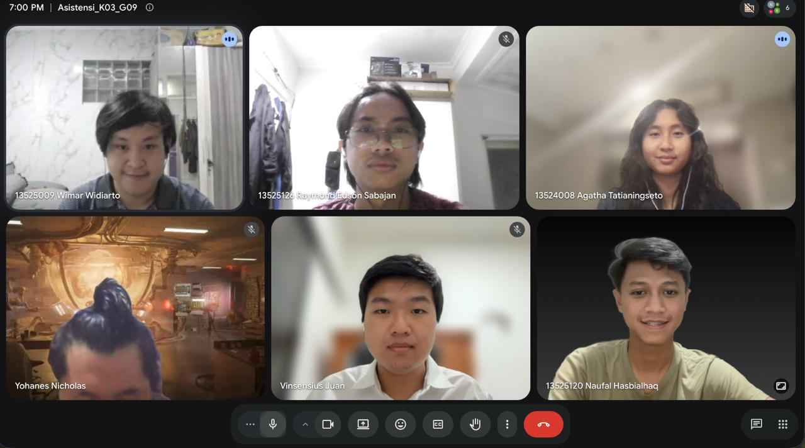

# Form Asistensi

## Tugas Besar IF2150 - Rekayasa Perangkat Lunak

| Informasi | Keterangan |
| --- | --- |
| **Hari** | *Selasa* |
| **Tanggal** | *29/09/2026* |
| **Kelas** | *K3* |
| **Nomor Kelompok** | *09*  |
| **Nama Kelompok** | *9naga*  |
| **Nama Perangkat Lunak** | *Cari Uang*  |
| **Dokumen** | *K03_G09_SKPL*  |

### Anggota Kelompok

| NIM | Nama |
| --- | --- |
| 13525120 | Naufal Hasbialhaq |
| 13525009 | Wimar Widiarto |
| 13525093 | Vinsensius Juan Setiady |
| 13525126 | Raymond Edson Sabajan |
| 13525048 | Yohanes Nicholas Setiawan |

### Catatan

Database ga perlu dibuat jadi class

Ui ga perlu buat 1 klas buat setiap halaman

Querry getter setter dari entity. Controller logic itu buat kyk enkripsi saat login.

1-9 dah bener, nanti di setiap objek harus dibreakdown jd entity, controller, ui.
Misal Pelanggan booking pekerjaan

Ada passing info antar keduanya. Pelanggan, pemberijasa, kontrak pekerjaan, komunikasi

Nanti bakal implement oop, semua hal di sistem harus objek. Pengguna menaungi pemberi jasa, pelanggan, layanan pelanggan. Misa ada UC
Login Register
Kalo setiap page dijadiin class sendiri terlalu banyak

Nanti tu desain kan dimasukkij fron end. Setiap interaksi UI dan manusia itu antar controller.

Pengguna Entity -> getter, setter, querryDb. Cth: getUserId, getPhoneNumber, etc
Pengguna Controller -> enkripsi, validasiInput, dll

Pengguna UI -> showLogin, showRegister, pressLogin, pressRegister, etc. Desain dan triggerController buat manipulasi db

KontrakPekerjaan -> create, modify, ubah kontrak.

Misal
Ui ada pressButtonMakeContract. Itu trigger function button diw controller. Controller nantiv akan panggil fungsi entity kyk makeContract

Modifikasi entity itu generalisasi masuk UI

Setiap table di db itu class  sendiri

UI-controller-entity
(- = asosiasi)

Kalo mau hubungin class lain hubungin ke entity
Contoh UC10:
RatingUI
      |
Rating-Rating Controller
     |
Pengguna - Pengguna Controller - Pengguna UI

Contoh dependency
Notifikasi <- - class lain karena trigger create objeknya depen dari objek lain, konten notif juga bergantung isi kelas lain, kalo kelas lain berubah, notif juga berubah

**Notes for this section:**  
*Catatan dapat dituliskan dalam bentuk paragraf atau poin-poin, disesuaikan saja.* 

## Dokumentasi

<!--  -->

  

  <i>Gambar 1. Dokumentasi kegiatan asistensi.</i>

