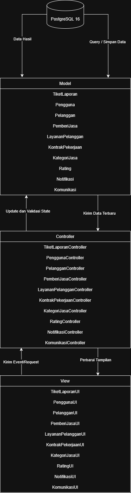

<h1>
IF2150 REKAYASA PERANGKAT LUNAK
 
TUGAS 6
 
ARSITEKTUR PERANGKAT LUNAK (APL)
</h1>
 

## CariUang

### Untuk: Agatha Tatianingseto

Dipersiapkan oleh:

| Informasi | Keterangan |
| --- | --- |
| Kelas | K03 |
| Kelompok | 09 |
| Nama Kelompok | 9naga |

| NIM       | Nama               |
| --------- | ------------------ |
| 13525120 | Naufal Hasbialhaq |
| 13525009 | Wimar Widiarto |
| 13525093 | Vinsensius Juan Setiady |
| 13525126 | Raymond Edson Sabajan |
| 13525048 | Yohanes Nicholas Setiawan |

---

 
 

# BAB 1: Style/Pattern Arsitektur Acuan

<i>Gambar 1. Arsitektur MVC Perangkat Lunak</i>

## 1.1 Style/Pattern yang Dipilih

CariUang menggunakan *style*: **MVC (*Model-View-Controller*)**. Komponen P/L dibagi menjadi tiga peran:

| Bagian | Peran |
| :--- | :--- | 
| ***View*** | Menampilkan halaman (login/registrasi, katalog jasa dan peta, kontrak pekerjaan, chat, tiket laporan, rating, notifikasi) dan meneruskan aksi pengguna ke *Controller*. *View* tidak menyimpan aturan bisnis. |
| ***Controller*** | Menerima permintaan dari *View*, memvalidasi input, menjalankan aturan bisnis (misalnya penguncian pemberi jasa, perubahan status 'On Progress' → 'Done', pembuatan tiket otomatis), lalu memanggil *Model*. |
| ***Model*** | Merepresentasikan data (Pengguna, KategoriJasa, KontrakPekerjaan, Komunikasi, TiketLaporan, Rating, Notifikasi), serta membaca dan menyimpan data ke basis data.|

| Komponen | Spesifikasi |
| :--- | :--- |
| *Server* | NodeJS (v24 LTS) dengan framework Express.js |
| *Client* | Aplikasi andorid|
| *DBMS* | Postgresql 16 |
| *OS* | Android OS |

Tabel 1.1. Lingkungan Operasi Perangkat Lunak

# BAB 2: Identifikasi Komponen / Modul / Subsistem

Tabel 2.1. Identifikasi Komponen/Modul/Subsistem

| Nama Komponen/Modul/Subsistem | Jenis | Penjelasan |
| :---------------------------- | :---- | :--------- |
| TiketLaporanUI | View | Menampilkan halaman pengajuan tiket laporan masalah bagi pelanggan dan pemberi jasa, serta meneruskan ke TiketLaporanController. |
| PenggunaUI | View | Menampilkan antarmuka umum akun pengguna dan meneruskan proses atau input pengguna ke PenggunaController. |
| PelangganUI | View | Menampilkan antarmuka beranda bagi pelanggan untuk mencari jasa, melihat peta lokasi pemberi jasa, memilih jasa, dan meneruskan  pemesanan ke PelangganController. |
| PemberiJasaUI | View | Menampilkan antarmuka bagi pemberi jasa untuk mengelola profil, menerima notifikasi pesanan masuk, dan meneruskan proses ke PemberiJasaController. |
| LayananPelangganUI | View | Menampilkan halaman bagi layanan pelanggan untuk memantau tiket kendala pengguna, merespons tiket laporan, dan meneruskannya ke LayananPelangganController. |
| KontrakPekerjaanUI | View | Menampilkan antarmuka pembuatan kesepakatan kontrak kerja, status pekerjaan, serta tombol konfirmasi penyelesaian kerja ke KontrakPekerjaanController. |
| KategoriJasaUI | View | Menampilkan halaman katalog kategori jasa dan daftar jenis jasa yang tersedia kepada pelanggan serta meneruskan aksi pemilihan kategori ke KategoriJasaController. |
| RatingUI | View | Menampilkan antarmuka pengisian skor penilaian (rating) dan ulasan dua arah setelah pekerjaan selesai serta meneruskan data ulasan ke RatingController. |
| NotifikasiUI | View | Menampilkan daftar pemberitahuan sistem dan notifikasi pesan baru atau tiket masuk kepada pengguna serta meneruskan interaksi notifikasi ke NotifikasiController. |
| KomunikasiUI | View | Menampilkan antarmuka obrolan (*chat*) interaktif antara pengguna (pelanggan–pemberi jasa untuk negosiasi atau pengguna–layanan pelanggan untuk mediasi) ke KomunikasiController. |
| TiketLaporanController | Controller | Memproses logika pembentukan tiket laporan serta memperbarui state pada Model TiketLaporan. |
| PenggunaController | Controller | Menangani logika akun pengguna (login dan registrasi), serta berinteraksi dengan Model Pengguna. |
| PelangganController | Controller | Mengatur logika interaksi pelanggan, validasi pemilihan jasa dan lokasi, inisiasi pesanan kerja, serta memperbarui state pada Model Pelanggan. |
| PemberiJasaController | Controller | Mengatur logika pendaftaran jasa, pemrosesan penerimaan/penolakan pesanan, penanganan batas waktu respons pesanan (30 menit), dan pembaruan state pada Model PemberiJasa. |
| LayananPelangganController | Controller | Mengatur logika penanganan tiket laporan, serta memperbarui state tindak lanjut tiket pada Model LayananPelanggan. |
| KontrakPekerjaanController | Controller | Mengatur logika kontrak kerja dan pembaruan state pada Model KontrakPekerjaan. |
| KategoriJasaController | Controller | Mengatur logika pengambilan dan pemfilteran data kategori serta jenis jasa dari Model KategoriJasa untuk ditampilkan ke pengguna. |
| RatingController | Controller | Memvalidasi masukan penilaian dua arah, menghitung akumulasi dan rata-rata rating pengguna, serta menyimpan hasil penilaian melalui Model Rating. |
| NotifikasiController | Controller | Memproses pembentukan notifikasi otomatis saat terjadi sebuah event dan mengelola data notifikasi melalui Model Notifikasi. |
| KomunikasiController | Controller | Mengatur pengiriman dan penerimaan pesan obrolan secara *real-time*, validasi isi pesan, dan pencatatan riwayat pesan ke Model Komunikasi. |
| TiketLaporan | Model | Merepresentasikan entitas data tiket laporan masalah serta membaca dan menyimpan data. |
| Pengguna | Model | Merepresentasikan entitas dasar data pengguna aplikasi serta membaca dan menyimpan data. |
| Pelanggan | Model | Merepresentasikan data profil khusus pelanggan dan preferensi pemesanan jasa serta mengelola status data pelanggan di basis data. |
| PemberiJasa | Model | Merepresentasikan data khusus pemberi jasa (keahlian, lokasi GPS, status ketersediaan, akumulasi rating, dan lain-lain) serta mengelola status data di basis data. |
| LayananPelanggan | Model | Merepresentasikan data profil layanan pelanggan serta. |
| KontrakPekerjaan | Model | Merepresentasikan data kesepakatan kerja. |
| KategoriJasa | Model | Merepresentasikan data kategori dan jenis jasa yang ditawarkan dalam sistem serta membaca dan menyimpan data. |
| Rating | Model | Merepresentasikan data evaluasi/penilaian kerja serta membaca dan menyimpan data. |
| Notifikasi | Model | Merepresentasikan data notifikasi sistem serta membaca dan menyimpan data. |
| Komunikasi | Model | Merepresentasikan data percakapan obrolan serta membaca dan menyimpan data. |
| PostgreSQL 16 | Database | Menyimpan seluruh sistem CariUang, melayani operasi *query*, dan manipulasi data dari lapisan Model. |

---

# BAB 3: Model Arsitektur Perangkat Lunak

*Architectural View* adalah bagaimana cara kita melihat/mendeskripsikan arsitektur sebuah sistem dari sudut pandang tertentu. Dalam perancangan arsitektur aplikasi, dibutuhkan *Architectural View* yang dapat mempermudah pemahaman dari proses aplikasi yang akan dikembangkan. Tujuan dari *Architectural View* adalah menjadi bahan komunikasi, pemisahan masalah, mempermudah analisis, dan pemandu saat eksekusi pengembangan sistem tersebut.

Buatlah model arsitektur dari aplikasi yang akan dirancang dalam bentuk *view*. Model arsitektur ini berfungsi untuk memperlihatkan bagaimana setiap komponen, modul, dan subsistem saling berinteraksi serta berkolaborasi dalam menjalankan fungsi utama sistem secara keseluruhan. Anda dapat membuat satu atau lebih *view* tergantung kebutuhan dalam bentuk gambar. Pilihlah notasi yang sesuai. Contoh *view* yang dapat digunakan antara lain ***Logical View***, ***Process View***, ***Development View***, serta ***Physical View***.

Ketentuan pengisian BAB 3:
1. Setiap view menggambarkan **keseluruhan sistem**, bukan satu use case atau satu fitur saja.
2. Buat **minimal satu view**. Setiap view dituliskan dalam subbab tersendiri (3.1, 3.2, dan seterusnya). Tidak perlu membuat keempat view, pilih yang paling membantu menjelaskan P/L Anda, lalu jelaskan alasan pemilihannya.
3. Setiap view harus **konsisten dengan BAB 2**. Seluruh komponen pada Tabel 2.1 harus muncul dengan nama yang sama, dan tidak boleh ada komponen pada view yang tidak terdaftar di Tabel 2.1.
4. Setiap view harus **mencerminkan style/pattern pada BAB 1**. Misalnya, jika memilih MVC, pembagian *Model*, *View*, dan *Controller* harus terlihat jelas pada diagram.
5. Jika membuat lebih dari satu view, setiap view harus menggambarkan sistem yang sama dari sudut pandang berbeda. View tambahan melengkapi view pertama, bukan mengulanginya.
6. Beri label pada setiap garis atau panah yang menghubungkan komponen agar hubungan antarkomponen dapat dipahami tanpa penjelasan tambahan.
7. Jika membuat *Physical View*, gambarkan lingkungan operasi pada Tabel 1.1.

## 3.1 XXX View

Tuliskan secara singkat mengenai model arsitektur perangkat lunak yang Anda pilih dan sertakan alasan mengapa model arsitektur tersebut cocok untuk aplikasi Anda.

<i>Gambar 2. Contoh Logical View pada P/L E-Commerce</i>

Gambar 2 adalah contoh *Logical View* dalam bentuk *block diagram*. Seluruh komponen pada Tabel 2.1 digambarkan dan dikelompokkan sesuai pola MVC (*View*, *Controller*, *Model*), ditambah komponen pendukung dan basis data. Sistem di luar P/L, seperti *Payment Gateway (dummy)*, digambarkan dengan garis putus-putus dan tidak perlu dimasukkan ke Tabel 2.1. Setiap garis diberi label: "Memanggil" untuk *View* yang memanggil *Controller*, "akses" untuk *Controller* yang mengakses *Model*, serta agregasi dan komposisi untuk hubungan antar-*Model*.

<b><i>Catatan</i></b>: <i>Ganti XXX dengan nama view yang dibuat, misalnya Logical View. Gambar 2 hanya contoh untuk P/L e-commerce, ganti dengan view milik kelompok Anda yang memuat seluruh komponen pada Tabel 2.1. Jenis view dan notasinya boleh berbeda dari contoh. Jika membuat view tambahan, lanjutkan pola 3.x ini (3.2, 3.3, dan seterusnya).</i>

---

# Referensi

- Sommerville, I. (2016). *Software Engineering* (10th ed.). Pearson. Chapter 6: *Architectural Design*: [https://software-engineering-book.com/slides/](https://software-engineering-book.com/slides/)
- Diagram arsitektur: [https://www.drawio.com/](https://www.drawio.com/), [https://staruml.io/](https://staruml.io/)
