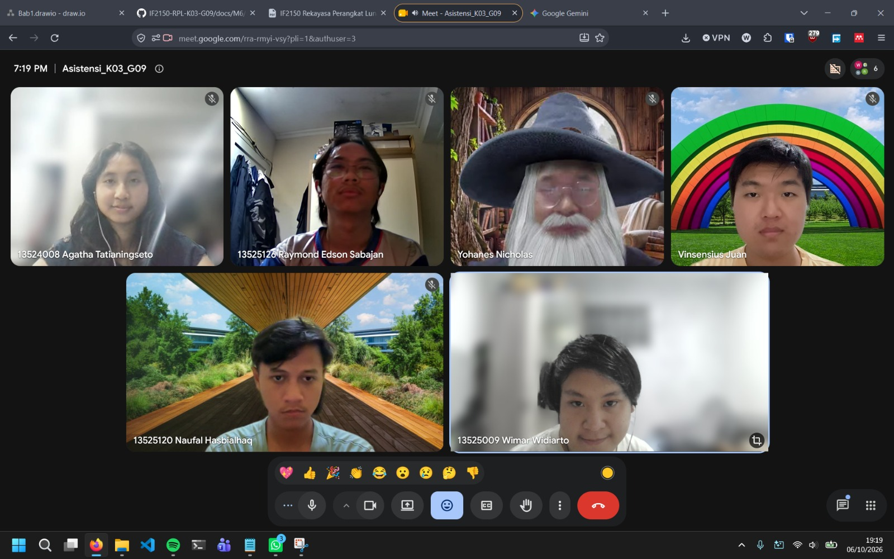

# Form Asistensi

## Tugas Besar IF2150 - Rekayasa Perangkat Lunak

| Informasi | Keterangan |
| --- | --- |
| **Hari** | *Selasa* |
| **Tanggal** | *29/09/2026* |
| **Kelas** | *K3* |
| **Nomor Kelompok** | *09*  |
| **Nama Kelompok** | *9naga*  |
| **Nama Perangkat Lunak** | *Cari Uang*  |
| **Dokumen** | *K03_G09_SKPL*  |

### Anggota Kelompok

| NIM | Nama |
| --- | --- |
| 13525120 | Naufal Hasbialhaq |
| 13525009 | Wimar Widiarto |
| 13525093 | Vinsensius Juan Setiady |
| 13525126 | Raymond Edson Sabajan |
| 13525048 | Yohanes Nicholas Setiawan |

### Catatan

Logical View
Bagiamana fungsi-fungsi system berhubungan dan pembagiannya. Bisa pake objek diagram/class daigram/ state machine diagram

Objek mirip kyk class tp cuma entity2 doang.

state machine diagram -> Definisikan intial state ke final statenya. Setiap statemachine harus ditentukan state apa aja yang bisa ada pada system kalian, kondisi dan trigger apa yang mengakibatkan perubahan state tersebut. Ada

jenis-jenis: DFA, NFA, etc

Process view -> Menggambarkan proses dari awal sampai akhir. Bisa pake activity diagram, communication diagram, sequence diagram

Development View -> Jika buat sebuah system harus bisa bagi menjadi beberapa modul/subsystem krn nanti saat eksekusi pembagiannya ngga cuma backend dan backend. Nanti akan dibagi menjadi modul2, kyk transaksi, manajemen produk, jual beli yang berisi komponen-komponen/class yang sudah didefinisikan sebelumnya. 
- Component Diagram, Ada subsistem dan dalamnya ada class-class yang didefiniskan sebelumnya. 

Physical View -> Memetakan system perangkat lunak ke hardwarenya, dari sudut pandang system engineer. Nanti dibagi berdasarkan server yang digunakan 

Boleh buat bbrp view. 

biar lebih rapih bisa pake lists di drawio

**Notes for this section:**  
*Catatan dapat dituliskan dalam bentuk paragraf atau poin-poin, disesuaikan saja.* 

## Dokumentasi

<!--  -->

  

  <i>Gambar 1. Dokumentasi kegiatan asistensi.</i>

